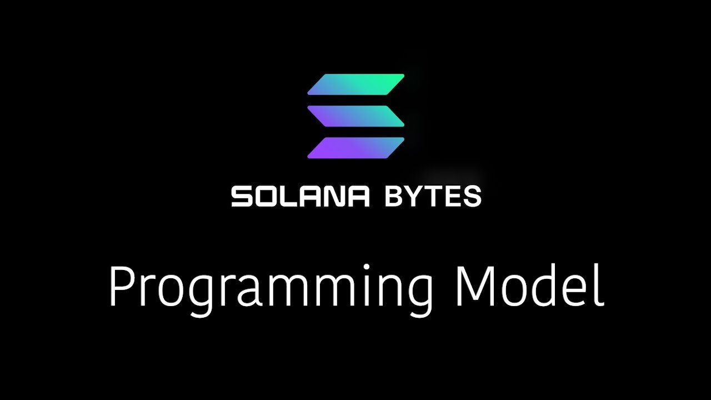
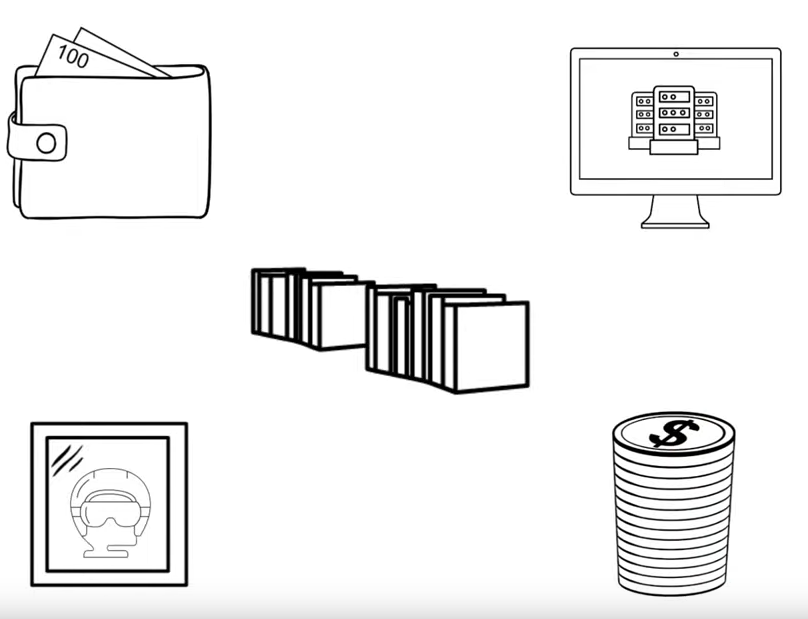
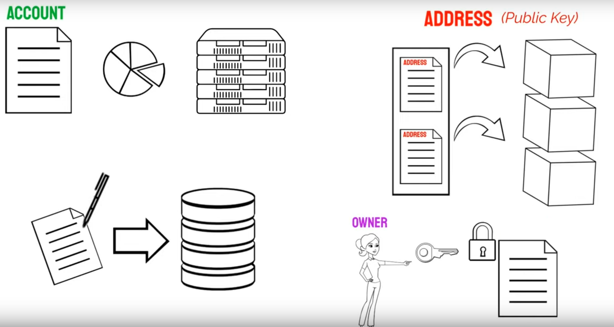
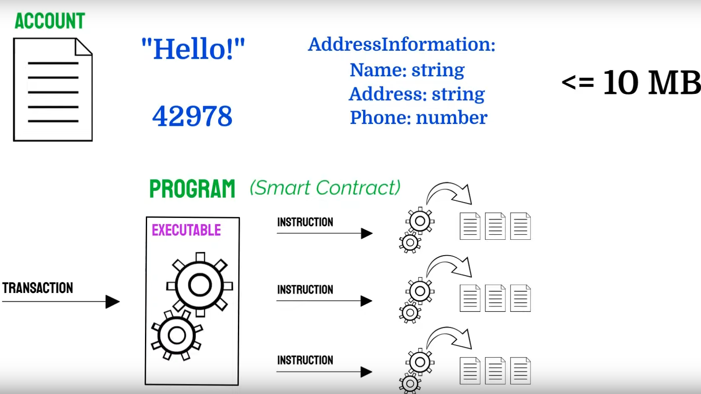
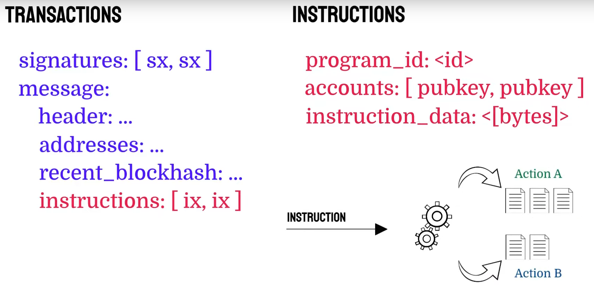
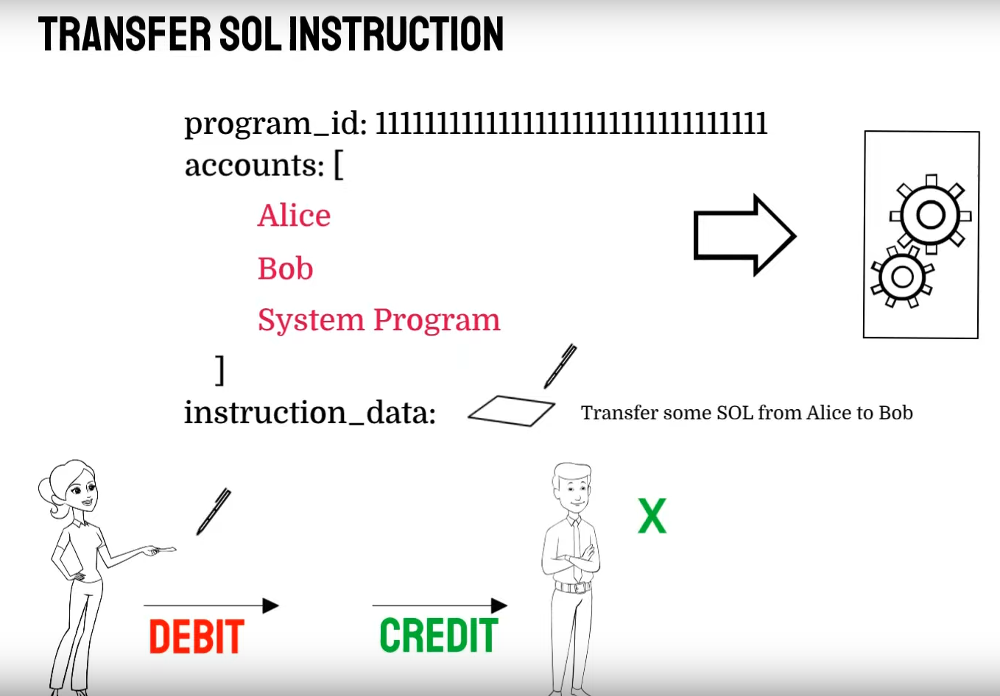
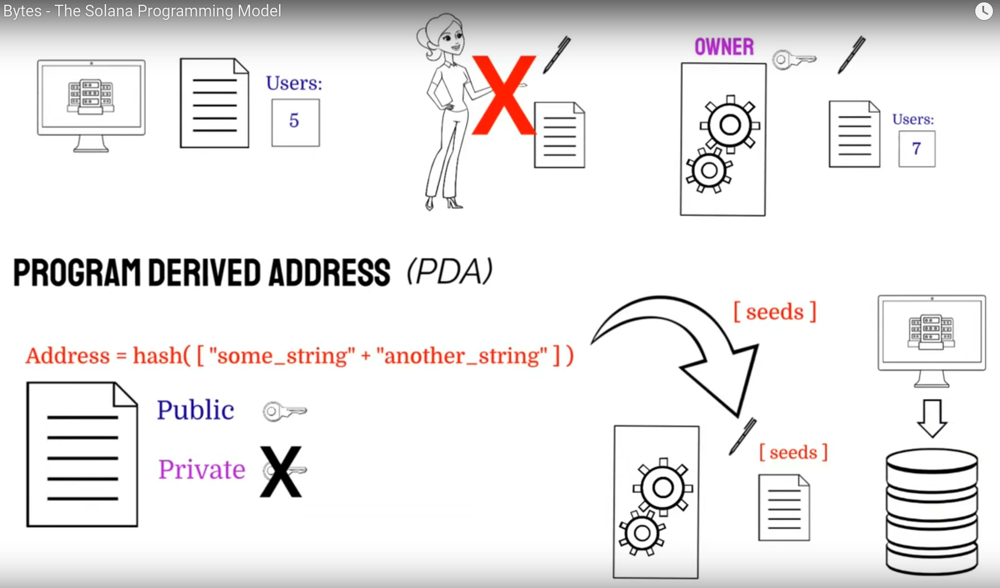

# [00:06](https://youtu.be/pRYs49MqapI?t=6) Solana's Programming Model and State Storage

Section Overview: This section introduces the programming model of Solana and explains how state is stored on the blockchain.

## Solana Accounts

- Everything on Solana is represented as an account, which is a claim to a specific size data storage on the blockchain.
- Accounts are similar to records in a database and are identified by a public key or address.
- Only the designated owner of an account can modify its data.
- Account data can be strings, numbers, objects, or even executable code.

## Transactions and Instructions

- A **transaction** in Solana contains (list of) signatures and a message.
- The message includes **instructions** that specify actions to be performed.
- Instructions contain program IDs or addresses of programs, accounts to be loaded by the runtime, and instruction data.
- Programs process instruction data to determine actions on provided accounts.

## Programs (Smart Contracts)

- Programs stored within accounts are called smart contracts or programs in Solana's runtime.
- These programs can be executed with transactions.
- Smart contracts can modify data in their associated accounts without requiring user signatures.

## Program Derived Addresses (PDAs)

- PDAs are accounts with public keys derived from deterministic seeds.
- They allow programs to algorithmically sign for transactions and modify data in associated accounts without private keys.
- PDAs enable storing application-specific data without requiring user signatures for every change.

# [02:36](https://youtu.be/pRYs49MqapI?t=156) Ownership and Signing Rules

Section Overview: This section discusses ownership and signing rules for accounts in Solana.

## Exception for Credits

- In most cases, only the designated owner of an account can modify its data by signing transactions.
- However, credits are an exception where debiting an account does not require the recipient's signature.

## Use Case: Tracking Active Users

- For scenarios like tracking active users on a DApp, it is not practical for one user to own and sign for the account.
- In such cases, the smart contract or program can be made the owner of the account.
- This allows the program to modify data in the account without requiring user signatures.

# [03:22](https://youtu.be/pRYs49MqapI?t=202) Program Derived Addresses (PDAs)

Section Overview: This section further explains Program Derived Addresses (PDAs) in Solana.

## Benefits of PDAs

- PDAs enable programs to algorithmically sign for transactions and modify associated accounts without private keys.
- They allow storing application-specific data without requiring user signatures for every change.
- PDAs provide a web 3 version of web 2 applications built on Solana.

[Generated with Video Highlight](https://videohighlight.com/video/summary/pRYs49MqapI)

# Transcription

- [00:00:05](https://youtu.be/DRZogmD647U?t=5) ➜ we're going to talk about solana's
- [00:00:07](https://youtu.be/DRZogmD647U?t=7) ➜ programming model and cover all the
- [00:00:09](https://youtu.be/DRZogmD647U?t=9) ➜ fundamentals you'll need to know to
- [00:00:10](https://youtu.be/DRZogmD647U?t=10) ➜ build on
- [00:00:11](https://youtu.be/DRZogmD647U?t=11) ➜ salana to start let's break down exactly
- [00:00:14](https://youtu.be/DRZogmD647U?t=14) ➜ how salana stores state for things like
- [00:00:16](https://youtu.be/DRZogmD647U?t=16) ➜ wallets daps and pretty much anything
- [00:00:19](https://youtu.be/DRZogmD647U?t=19) ➜ else that operates on
- [00:00:21](https://youtu.be/DRZogmD647U?t=21) ➜ salana everything on salana is an
- [00:00:24](https://youtu.be/DRZogmD647U?t=24) ➜ account an account is a claim to a
- [00:00:26](https://youtu.be/DRZogmD647U?t=26) ➜ specific size data storage on the
- [00:00:28](https://youtu.be/DRZogmD647U?t=28) ➜ blockchain you can take of an account
- [00:00:30](https://youtu.be/DRZogmD647U?t=30) ➜ almost like a record in a
- [00:00:32](https://youtu.be/DRZogmD647U?t=32) ➜ database like a database record you have
- [00:00:35](https://youtu.be/DRZogmD647U?t=35) ➜ to have some kind of mapping to this
- [00:00:37](https://youtu.be/DRZogmD647U?t=37) ➜ onchain location this is done with a
- [00:00:40](https://youtu.be/DRZogmD647U?t=40) ➜ public key or
- [00:00:41](https://youtu.be/DRZogmD647U?t=41) ➜ address and most importantly only an
- [00:00:44](https://youtu.be/DRZogmD647U?t=44) ➜ account's designated owner can modify
- [00:00:46](https://youtu.be/DRZogmD647U?t=46) ➜ its
- [00:00:49](https://youtu.be/DRZogmD647U?t=49) ➜ data data in a salana account can be
- [00:00:51](https://youtu.be/DRZogmD647U?t=51) ➜ anything strings numbers objects as long
- [00:00:55](https://youtu.be/DRZogmD647U?t=55) ➜ as its BTE representation is less than
- [00:00:57](https://youtu.be/DRZogmD647U?t=57) ➜ 10 megabytes accounts can even even
- [00:01:00](https://youtu.be/DRZogmD647U?t=60) ➜ store executable code these accounts
- [00:01:02](https://youtu.be/DRZogmD647U?t=62) ➜ marked as executable on Solana's runtime
- [00:01:05](https://youtu.be/DRZogmD647U?t=65) ➜ are called programs or smart contracts
- [00:01:07](https://youtu.be/DRZogmD647U?t=67) ➜ and other
- [00:01:09](https://youtu.be/DRZogmD647U?t=69) ➜ blockchains programs are exactly what
- [00:01:11](https://youtu.be/DRZogmD647U?t=71) ➜ they sound like they're software
- [00:01:13](https://youtu.be/DRZogmD647U?t=73) ➜ programs stored within an account that
- [00:01:14](https://youtu.be/DRZogmD647U?t=74) ➜ could be executed with
- [00:01:16](https://youtu.be/DRZogmD647U?t=76) ➜ transactions let's break down a
- [00:01:18](https://youtu.be/DRZogmD647U?t=78) ➜ transaction a transaction contains a
- [00:01:21](https://youtu.be/DRZogmD647U?t=81) ➜ list of signatures and a message that
- [00:01:23](https://youtu.be/DRZogmD647U?t=83) ➜ message then contains a list of
- [00:01:25](https://youtu.be/DRZogmD647U?t=85) ➜ instructions an instruction contains a
- [00:01:28](https://youtu.be/DRZogmD647U?t=88) ➜ program ID or address
- [00:01:30](https://youtu.be/DRZogmD647U?t=90) ➜ of the program that the instruction is
- [00:01:31](https://youtu.be/DRZogmD647U?t=91) ➜ for a list of accounts that need to be
- [00:01:34](https://youtu.be/DRZogmD647U?t=94) ➜ loaded by the runtime and the
- [00:01:36](https://youtu.be/DRZogmD647U?t=96) ➜ instruction data programs then process
- [00:01:39](https://youtu.be/DRZogmD647U?t=99) ➜ that instruction data to determine what
- [00:01:41](https://youtu.be/DRZogmD647U?t=101) ➜ actions to take on which accounts that
- [00:01:43](https://youtu.be/DRZogmD647U?t=103) ➜ have been provided in the instruction
- [00:01:46](https://youtu.be/DRZogmD647U?t=106) ➜ for example an instruction for a
- [00:01:48](https://youtu.be/DRZogmD647U?t=108) ➜ transfer of Soul would be directed to
- [00:01:50](https://youtu.be/DRZogmD647U?t=110) ➜ Solana's System
- [00:01:51](https://youtu.be/DRZogmD647U?t=111) ➜ Program it would contain the sender the
- [00:01:54](https://youtu.be/DRZogmD647U?t=114) ➜ recipient and the system program and the
- [00:01:57](https://youtu.be/DRZogmD647U?t=117) ➜ instruction data would tell the system
- [00:01:59](https://youtu.be/DRZogmD647U?t=119) ➜ prr program to conduct a transfer from
- [00:02:02](https://youtu.be/DRZogmD647U?t=122) ➜ the sender to the
- [00:02:03](https://youtu.be/DRZogmD647U?t=123) ➜ recipient also in this example Alice
- [00:02:06](https://youtu.be/DRZogmD647U?t=126) ➜ would have to sign this transaction with
- [00:02:08](https://youtu.be/DRZogmD647U?t=128) ➜ her private key because she's going to
- [00:02:10](https://youtu.be/DRZogmD647U?t=130) ➜ be debiting her account and sending soul
- [00:02:13](https://youtu.be/DRZogmD647U?t=133) ➜ out however Bob does not have to sign
- [00:02:16](https://youtu.be/DRZogmD647U?t=136) ➜ for this transaction because he's
- [00:02:19](https://youtu.be/DRZogmD647U?t=139) ➜ receiving soul and credits are the only
- [00:02:21](https://youtu.be/DRZogmD647U?t=141) ➜ exception to the account ownership and
- [00:02:24](https://youtu.be/DRZogmD647U?t=144) ➜ signing rules on
- [00:02:25](https://youtu.be/DRZogmD647U?t=145) ➜ salana so authorizing debits makes sense
- [00:02:29](https://youtu.be/DRZogmD647U?t=149) ➜ but what if we had a DB and we wanted to
- [00:02:32](https://youtu.be/DRZogmD647U?t=152) ➜ just have an account that kept track of
- [00:02:33](https://youtu.be/DRZogmD647U?t=153) ➜ the number of active users on our dap
- [00:02:36](https://youtu.be/DRZogmD647U?t=156) ➜ would we want one particular user to own
- [00:02:39](https://youtu.be/DRZogmD647U?t=159) ➜ this account and therefore have to sign
- [00:02:41](https://youtu.be/DRZogmD647U?t=161) ➜ for it every time we wanted to modify
- [00:02:43](https://youtu.be/DRZogmD647U?t=163) ➜ the number of users on our dab of course
- [00:02:46](https://youtu.be/DRZogmD647U?t=166) ➜ not instead we can make our smart
- [00:02:49](https://youtu.be/DRZogmD647U?t=169) ➜ contract or program the owner of this
- [00:02:52](https://youtu.be/DRZogmD647U?t=172) ➜ account this way the program can now
- [00:02:55](https://youtu.be/DRZogmD647U?t=175) ➜ modify the data and change any of the
- [00:02:58](https://youtu.be/DRZogmD647U?t=178) ➜ values in the account so we no longer
- [00:03:00](https://youtu.be/DRZogmD647U?t=180) ➜ require the signature of any user on our
- [00:03:02](https://youtu.be/DRZogmD647U?t=182) ➜ Deb so how does this work well salana
- [00:03:06](https://youtu.be/DRZogmD647U?t=186) ➜ uses what are called program derived
- [00:03:09](https://youtu.be/DRZogmD647U?t=189) ➜ addresses which are basically accounts
- [00:03:12](https://youtu.be/DRZogmD647U?t=192) ➜ that have a public key that can be
- [00:03:14](https://youtu.be/DRZogmD647U?t=194) ➜ derived from a deterministic set of
- [00:03:16](https://youtu.be/DRZogmD647U?t=196) ➜ seeds the key here is that these
- [00:03:18](https://youtu.be/DRZogmD647U?t=198) ➜ accounts by Design don't have private
- [00:03:21](https://youtu.be/DRZogmD647U?t=201) ➜ Keys instead programs can use these
- [00:03:24](https://youtu.be/DRZogmD647U?t=204) ➜ seeds to algorithmically sign for
- [00:03:26](https://youtu.be/DRZogmD647U?t=206) ➜ transactions and modify data in accounts
- [00:03:28](https://youtu.be/DRZogmD647U?t=208) ➜ that are PD
- [00:03:30](https://youtu.be/DRZogmD647U?t=210) ➜ using pdas we can store data about our
- [00:03:33](https://youtu.be/DRZogmD647U?t=213) ➜ application in accounts without
- [00:03:34](https://youtu.be/DRZogmD647U?t=214) ➜ requiring our users to sign for every
- [00:03:37](https://youtu.be/DRZogmD647U?t=217) ➜ change this is basically the web 3
- [00:03:39](https://youtu.be/DRZogmD647U?t=219) ➜ version of a web 2 application built on
- [00:03:42](https://youtu.be/DRZogmD647U?t=222) ➜ top of a database that it can read and
- [00:03:44](https://youtu.be/DRZogmD647U?t=224) ➜ write from at any
- [00:03:47](https://youtu.be/DRZogmD647U?t=227) ➜ time all right those are the basics now
- [00:03:50](https://youtu.be/DRZogmD647U?t=230) ➜ you guys are ready to build
