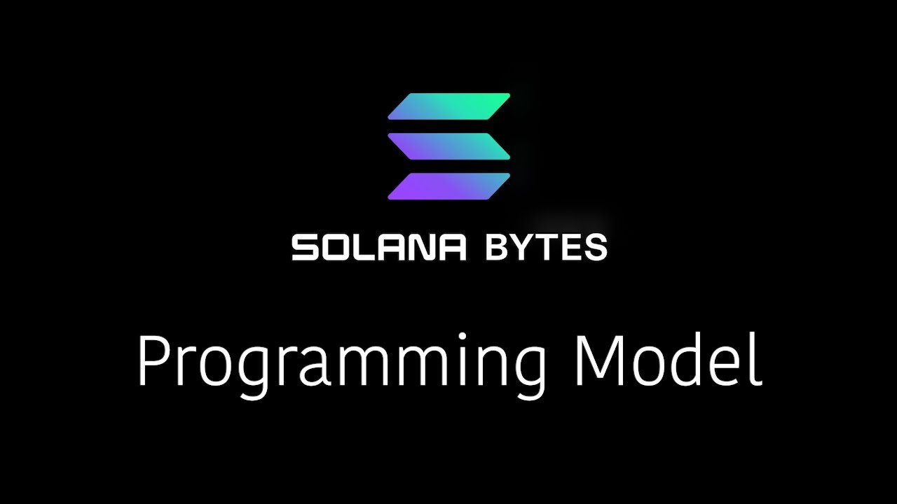

# [00:06](https://youtu.be/pRYs49MqapI?t=6) Solana's Programming Model and State Storage

Section Overview: This section introduces the programming model of Solana and explains how state is stored on the blockchain.

## Solana Accounts

- Everything on Solana is represented as an account, which is a claim to a specific size data storage on the blockchain.
- Accounts are similar to records in a database and are identified by a public key or address.
- Only the designated owner of an account can modify its data.
- Account data can be strings, numbers, objects, or even executable code.

## Transactions and Instructions

- A transaction in Solana contains signatures and a message.
- The message includes instructions that specify actions to be performed.
- Instructions contain program IDs or addresses of programs, accounts to be loaded by the runtime, and instruction data.
- Programs process instruction data to determine actions on provided accounts.

## Programs (Smart Contracts)

- Programs stored within accounts are called smart contracts or programs in Solana's runtime.
- These programs can be executed with transactions.
- Smart contracts can modify data in their associated accounts without requiring user signatures.

## Program Derived Addresses (PDAs)

- PDAs are accounts with public keys derived from deterministic seeds.
- They allow programs to algorithmically sign for transactions and modify data in associated accounts without private keys.
- PDAs enable storing application-specific data without requiring user signatures for every change.

# [02:36](https://youtu.be/pRYs49MqapI?t=156) Ownership and Signing Rules

Section Overview: This section discusses ownership and signing rules for accounts in Solana.

## Exception for Credits

- In most cases, only the designated owner of an account can modify its data by signing transactions.
- However, credits are an exception where debiting an account does not require the recipient's signature.

## Use Case: Tracking Active Users

- For scenarios like tracking active users on a DApp, it is not practical for one user to own and sign for the account.
- In such cases, the smart contract or program can be made the owner of the account.
- This allows the program to modify data in the account without requiring user signatures.

# [03:22](https://youtu.be/pRYs49MqapI?t=202) Program Derived Addresses (PDAs)

Section Overview: This section further explains Program Derived Addresses (PDAs) in Solana.

## Benefits of PDAs

- PDAs enable programs to algorithmically sign for transactions and modify associated accounts without private keys.
- They allow storing application-specific data without requiring user signatures for every change.
- PDAs provide a web 3 version of web 2 applications built on Solana.

[Generated with Video Highlight](https://videohighlight.com/video/summary/pRYs49MqapI)