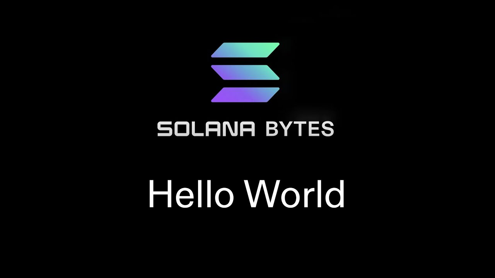
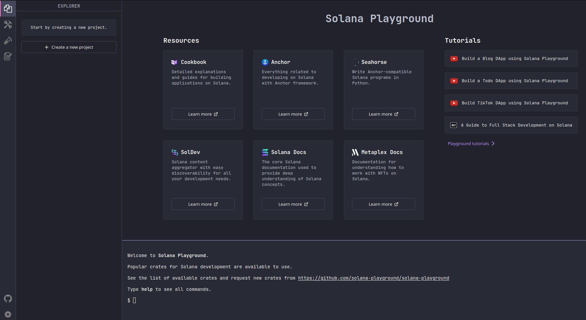
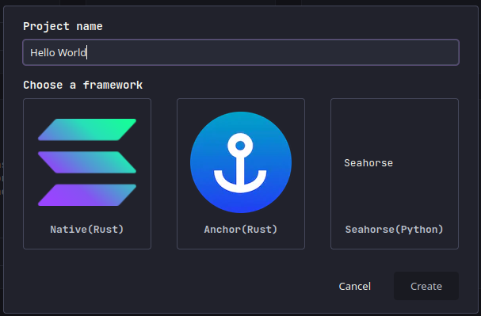

# [](https://youtu.be/L1O0-VNrz7s?t=0) Introduction to Writing Solana Programs

In this section, the speaker introduces the process of writing a Solana program. They explain that a transaction consists of a list of signatures and a message containing instructions. These instructions are sent to programs on the Solana chain. The speaker also mentions the parameters involved in an instruction, such as the program ID and accounts.

[program-examples/basics/hello-solana at main · solana-developers/program-examples · GitHub](https://github.com/solana-developers/program-examples/tree/main/basics/hello-solana)

## Understanding Transactions and Instructions

For a closer look at transactions, check out the [Solana Core Docs](https://docs.solana.com/developing/programming-model/transactions) or the [Solana Cookbook](https://solanacookbook.com/core-concepts/transactions.html#facts).

**The anatomy of a transaction is as follows, but here's the keys:**

🔑 **Transactions** are for **the Solana runtime**. They contain information that Solana uses to allow or deny a transaction (signers, blockhash, etc.) and choose whether to process instructions in parallel.   
🔑 **Instructions** are for **Solana programs**. They tell the program what to do.   
🔑 Our program receives one instruction at a time (`program_id`, `accounts`, `instruction_data`).

### Transaction
```shell
signatures: [ s, s ]
message:
    header: 000
    addresses: [ aaa, aaa ]
    recent_blockhash: int
    instructions: [ ix, ix ]
```
### Instruction
```shell
program_id: xxx
accounts: [ aaa, aaa ]
instruction_data: b[]
```
- A transaction consists of signatures and a message with instructions.
- Instructions are sent to programs on the Solana chain.
- Parameters in an instruction include program ID and accounts.

# [00:18](https://youtu.be/L1O0-VNrz7s?t=18) Implementing Programs using Rust

This section focuses on implementing programs using Rust for Solana. The speaker demonstrates how to use the **[Solana Playground IDE](https://beta.solpg.io/)**, a web-based IDE that eliminates the need for installing additional software. They show how to set up a new project and choose different frameworks for writing Solana programs.

## Using Solana Playground IDE



- Solana Playground IDE is a web-based IDE for writing Solana programs.
- No need to install Solana Rust Cargo or other dependencies.
- Set up a new project in Solana Playground IDE.
- Choose different frameworks for writing Solana programs.

# [01:20](https://youtu.be/L1O0-VNrz7s?t=80) Exploring Hello World Code

In this section, the speaker explores the "Hello World" code provided in Solana Playground IDE. They highlight the `process_instruction` function as the entry point of the program. This function receives instructions and performs actions based on them. The speaker explains how this function is marked as the entry point using a macro.



## Understanding `process_instruction` Function

- `process_instruction` function is marked as the entry point of the program.
- It receives instructions and performs actions based on them.
- Macro is used to mark the function as the entry point.

# [01:39](https://youtu.be/L1O0-VNrz7s?t=99) Adding Logic to Read and Manipulate Accounts

In this section, the speaker demonstrates how to add logic to read and manipulate accounts in a Solana program. They show how to iterate over a vector of account info types and render each one as an account info object. The speaker explains that public keys are retrieved by the runtime, and if successful, the accounts can be loaded into the code.

## Reading and Manipulating Accounts

- Iterate over a vector of account info types.
- Render each account as an account info object.
- Public keys are retrieved by the runtime.
- Successfully read accounts can be loaded into the code.

# [02:55](https://youtu.be/L1O0-VNrz7s?t=175) Deploying and Testing a Program

This section focuses on deploying and testing a Solana program. The speaker demonstrates how to deploy a program using Solana Playground IDE. They also show how to set up a connection to Devnet, create key pairs for payer and program ID, build instructions, sign transactions, and view program logs.

## Deploying and Testing Process

- Deploy a program using Solana Playground IDE.
- Set up connection to Devnet.
- Create key pairs for payer and program ID.
- Build instructions for transactions.
- Sign transactions with payer's key pair.
- View program logs using `Solana logs`.

[Generated with Video Highlight](https://videohighlight.com/video/summary/L1O0-VNrz7s)

# Transcription

- [00:00:01](https://youtu.be/DRZogmD647U?t=1) ➜ we're going to write our first solana
- [00:00:03](https://youtu.be/DRZogmD647U?t=3) ➜ program so to get started let's take a
- [00:00:05](https://youtu.be/DRZogmD647U?t=5) ➜ look at what a transaction looks like we
- [00:00:07](https://youtu.be/DRZogmD647U?t=7) ➜ got a list of signatures and a message
- [00:00:09](https://youtu.be/DRZogmD647U?t=9) ➜ and inside that message is a list of
- [00:00:11](https://youtu.be/DRZogmD647U?t=11) ➜ instructions now these instructions are
- [00:00:13](https://youtu.be/DRZogmD647U?t=13) ➜ what actually go and hit programs right
- [00:00:16](https://youtu.be/DRZogmD647U?t=16) ➜ so those are what clients send to
- [00:00:18](https://youtu.be/DRZogmD647U?t=18) ➜ programs that live on chain a program is
- [00:00:21](https://youtu.be/DRZogmD647U?t=21) ➜ just a bunch of bite code that has been
- [00:00:23](https://youtu.be/DRZogmD647U?t=23) ➜ put into an account on salon's chain and
- [00:00:26](https://youtu.be/DRZogmD647U?t=26) ➜ it can be invoked with instructions so
- [00:00:29](https://youtu.be/DRZogmD647U?t=29) ➜ pay attention to these parameters here
- [00:00:31](https://youtu.be/DRZogmD647U?t=31) ➜ we've got program ID that's the program
- [00:00:33](https://youtu.be/DRZogmD647U?t=33) ➜ that this instruction is intended for
- [00:00:36](https://youtu.be/DRZogmD647U?t=36) ➜ the accounts which is just a list of
- [00:00:37](https://youtu.be/DRZogmD647U?t=37) ➜ public keys of accounts that are going
- [00:00:39](https://youtu.be/DRZogmD647U?t=39) ➜ to be involved in whatever operation
- [00:00:41](https://youtu.be/DRZogmD647U?t=41) ➜ this thing is conducting and finally the
- [00:00:44](https://youtu.be/DRZogmD647U?t=44) ➜ instruction data which comes in as bytes
- [00:00:46](https://youtu.be/DRZogmD647U?t=46) ➜ but it can serialize into actual rust
- [00:00:49](https://youtu.be/DRZogmD647U?t=49) ➜ instructions to tell these programs what
- [00:00:51](https://youtu.be/DRZogmD647U?t=51) ➜ to do now let's go see this actually
- [00:00:54](https://youtu.be/DRZogmD647U?t=54) ➜ implemented in a program using rust this
- [00:00:58](https://youtu.be/DRZogmD647U?t=58) ➜ is the solana playground IDE so this is
- [00:01:00](https://youtu.be/DRZogmD647U?t=60) ➜ a web- based IDE and that means you
- [00:01:03](https://youtu.be/DRZogmD647U?t=63) ➜ don't actually have to install solana
- [00:01:05](https://youtu.be/DRZogmD647U?t=65) ➜ rust cargo or anything else all you need
- [00:01:08](https://youtu.be/DRZogmD647U?t=68) ➜ to do is go to beta.
- [00:01:11](https://youtu.be/DRZogmD647U?t=71) ➜ pg. go ahead and connect a wallet and
- [00:01:14](https://youtu.be/DRZogmD647U?t=74) ➜ then you can get set up so we're going
- [00:01:16](https://youtu.be/DRZogmD647U?t=76) ➜ to set up a new project here and you can
- [00:01:18](https://youtu.be/DRZogmD647U?t=78) ➜ see that the different Frameworks you
- [00:01:20](https://youtu.be/DRZogmD647U?t=80) ➜ can actually write Salon of programs in
- [00:01:22](https://youtu.be/DRZogmD647U?t=82) ➜ come up as options so we're going to
- [00:01:24](https://youtu.be/DRZogmD647U?t=84) ➜ just go with hello world and we're going
- [00:01:27](https://youtu.be/DRZogmD647U?t=87) ➜ to choose native we'll cover the other
- [00:01:29](https://youtu.be/DRZogmD647U?t=89) ➜ two in some future videos so let's take
- [00:01:31](https://youtu.be/DRZogmD647U?t=91) ➜ a look at this hello world code here and
- [00:01:33](https://youtu.be/DRZogmD647U?t=93) ➜ see what's going on now the first thing
- [00:01:36](https://youtu.be/DRZogmD647U?t=96) ➜ you guys should notice is this function
- [00:01:38](https://youtu.be/DRZogmD647U?t=98) ➜ down here process instruction right
- [00:01:41](https://youtu.be/DRZogmD647U?t=101) ➜ we're marking that as the entry point of
- [00:01:43](https://youtu.be/DRZogmD647U?t=103) ➜ our program using this macro and that
- [00:01:46](https://youtu.be/DRZogmD647U?t=106) ➜ just tells solana that that's going to
- [00:01:47](https://youtu.be/DRZogmD647U?t=107) ➜ be the program's entry point which is
- [00:01:49](https://youtu.be/DRZogmD647U?t=109) ➜ pretty straightforward it's where those
- [00:01:51](https://youtu.be/DRZogmD647U?t=111) ➜ instructions are going to go to and
- [00:01:52](https://youtu.be/DRZogmD647U?t=112) ➜ that's exactly why they have the same
- [00:01:55](https://youtu.be/DRZogmD647U?t=115) ➜ exact parameters that we saw on the
- [00:01:56](https://youtu.be/DRZogmD647U?t=116) ➜ instruction setup makes sense right so
- [00:01:59](https://youtu.be/DRZogmD647U?t=119) ➜ now we we just got some logging going on
- [00:02:01](https://youtu.be/DRZogmD647U?t=121) ➜ here nothing crazy but let's go ahead
- [00:02:03](https://youtu.be/DRZogmD647U?t=123) ➜ and actually add some logic to read in
- [00:02:05](https://youtu.be/DRZogmD647U?t=125) ➜ and maybe do some stuff with some
- [00:02:07](https://youtu.be/DRZogmD647U?t=127) ➜ accounts so as you can see we're reading
- [00:02:09](https://youtu.be/DRZogmD647U?t=129) ➜ in these accounts using an iter right so
- [00:02:12](https://youtu.be/DRZogmD647U?t=132) ➜ we're going to iterate over this Vector
- [00:02:14](https://youtu.be/DRZogmD647U?t=134) ➜ that comes in of account info types and
- [00:02:17](https://youtu.be/DRZogmD647U?t=137) ➜ as we do that we're going to just render
- [00:02:19](https://youtu.be/DRZogmD647U?t=139) ➜ each one as an account info object
- [00:02:22](https://youtu.be/DRZogmD647U?t=142) ➜ that's of course if it's been
- [00:02:23](https://youtu.be/DRZogmD647U?t=143) ➜ successfully read in now what's going on
- [00:02:27](https://youtu.be/DRZogmD647U?t=147) ➜ here well these public Keys come in the
- [00:02:30](https://youtu.be/DRZogmD647U?t=150) ➜ runtime goes and retrieves these
- [00:02:31](https://youtu.be/DRZogmD647U?t=151) ➜ accounts and then if it all checks out
- [00:02:34](https://youtu.be/DRZogmD647U?t=154) ➜ we can actually load them into our code
- [00:02:36](https://youtu.be/DRZogmD647U?t=156) ➜ so in this situation we have a payer
- [00:02:39](https://youtu.be/DRZogmD647U?t=159) ➜ which is like somebody who just paid for
- [00:02:41](https://youtu.be/DRZogmD647U?t=161) ➜ the transaction fee and signed for the
- [00:02:44](https://youtu.be/DRZogmD647U?t=164) ➜ transaction and then we also have the
- [00:02:46](https://youtu.be/DRZogmD647U?t=166) ➜ system program and this is going to be
- [00:02:48](https://youtu.be/DRZogmD647U?t=168) ➜ the public key of Solana's System
- [00:02:51](https://youtu.be/DRZogmD647U?t=171) ➜ Program which looks like all ones we'll
- [00:02:54](https://youtu.be/DRZogmD647U?t=174) ➜ talk about the system program in a
- [00:02:56](https://youtu.be/DRZogmD647U?t=176) ➜ future video it'll actually come up a
- [00:02:58](https://youtu.be/DRZogmD647U?t=178) ➜ lot as you do Stefan solana but let's go
- [00:03:00](https://youtu.be/DRZogmD647U?t=180) ➜ actually deploy this program and let's
- [00:03:02](https://youtu.be/DRZogmD647U?t=182) ➜ hit it with a test so if you hit this
- [00:03:04](https://youtu.be/DRZogmD647U?t=184) ➜ wrench and Hammer tab up in Soul PG you
- [00:03:07](https://youtu.be/DRZogmD647U?t=187) ➜ see we have this build option go ahead
- [00:03:09](https://youtu.be/DRZogmD647U?t=189) ➜ and build the program and once you've
- [00:03:11](https://youtu.be/DRZogmD647U?t=191) ➜ built that successfully you can go ahead
- [00:03:13](https://youtu.be/DRZogmD647U?t=193) ➜ and click
- [00:03:14](https://youtu.be/DRZogmD647U?t=194) ➜ deploy and that's it we just deployed
- [00:03:16](https://youtu.be/DRZogmD647U?t=196) ➜ our program to devet and notice how fast
- [00:03:19](https://youtu.be/DRZogmD647U?t=199) ➜ that was to build with soul PG and it
- [00:03:21](https://youtu.be/DRZogmD647U?t=201) ➜ was even pretty quick to deploy as well
- [00:03:24](https://youtu.be/DRZogmD647U?t=204) ➜ also what we can do here is we can check
- [00:03:26](https://youtu.be/DRZogmD647U?t=206) ➜ out this program credentials tab click
- [00:03:29](https://youtu.be/DRZogmD647U?t=209) ➜ that open grab our program's ID and we
- [00:03:32](https://youtu.be/DRZogmD647U?t=212) ➜ can use it in our test which looks like
- [00:03:34](https://youtu.be/DRZogmD647U?t=214) ➜ this so the first thing we're doing is
- [00:03:36](https://youtu.be/DRZogmD647U?t=216) ➜ setting up a new connection to devet we
- [00:03:39](https://youtu.be/DRZogmD647U?t=219) ➜ use this create key pair from file
- [00:03:41](https://youtu.be/DRZogmD647U?t=221) ➜ function to load our local key pair in
- [00:03:43](https://youtu.be/DRZogmD647U?t=223) ➜ as our payer who's going to be paying
- [00:03:45](https://youtu.be/DRZogmD647U?t=225) ➜ for the transaction fees and then we can
- [00:03:47](https://youtu.be/DRZogmD647U?t=227) ➜ drop our program ID right here and then
- [00:03:50](https://youtu.be/DRZogmD647U?t=230) ➜ of course here we're just building an
- [00:03:52](https://youtu.be/DRZogmD647U?t=232) ➜ instruction and take a look again this
- [00:03:55](https://youtu.be/DRZogmD647U?t=235) ➜ is the same exact format that we've seen
- [00:03:57](https://youtu.be/DRZogmD647U?t=237) ➜ twice now so we've got our program ID
- [00:04:00](https://youtu.be/DRZogmD647U?t=240) ➜ which is going to be of course our
- [00:04:01](https://youtu.be/DRZogmD647U?t=241) ➜ program we've got a list of accounts so
- [00:04:04](https://youtu.be/DRZogmD647U?t=244) ➜ the public key and then a little bit of
- [00:04:06](https://youtu.be/DRZogmD647U?t=246) ➜ information about them as well right so
- [00:04:08](https://youtu.be/DRZogmD647U?t=248) ➜ the payer in this case we pass in their
- [00:04:10](https://youtu.be/DRZogmD647U?t=250) ➜ public key but we also have to tell
- [00:04:12](https://youtu.be/DRZogmD647U?t=252) ➜ solana that the payer is in fact the
- [00:04:14](https://youtu.be/DRZogmD647U?t=254) ➜ signer and their account is writable and
- [00:04:17](https://youtu.be/DRZogmD647U?t=257) ➜ that's because in order for them to pay
- [00:04:18](https://youtu.be/DRZogmD647U?t=258) ➜ for a transaction we have to be able to
- [00:04:20](https://youtu.be/DRZogmD647U?t=260) ➜ debit them a little tiny amount of soul
- [00:04:23](https://youtu.be/DRZogmD647U?t=263) ➜ to pay for the transaction fee right so
- [00:04:25](https://youtu.be/DRZogmD647U?t=265) ➜ we have to tell solana that this account
- [00:04:27](https://youtu.be/DRZogmD647U?t=267) ➜ is going to be writable we're going
- [00:04:29](https://youtu.be/DRZogmD647U?t=269) ➜ going to be changing its balance now
- [00:04:31](https://youtu.be/DRZogmD647U?t=271) ➜ here we also go grab the system programs
- [00:04:34](https://youtu.be/DRZogmD647U?t=274) ➜ ID which I mentioned it's all ones it's
- [00:04:37](https://youtu.be/DRZogmD647U?t=277) ➜ a constant so we just can reference it
- [00:04:39](https://youtu.be/DRZogmD647U?t=279) ➜ like this but it's not the signer and
- [00:04:42](https://youtu.be/DRZogmD647U?t=282) ➜ it's not writable this would be our
- [00:04:44](https://youtu.be/DRZogmD647U?t=284) ➜ instruction data here but we don't have
- [00:04:45](https://youtu.be/DRZogmD647U?t=285) ➜ any so we're just allocating using
- [00:04:47](https://youtu.be/DRZogmD647U?t=287) ➜ buffer zero and finally we're going to
- [00:04:50](https://youtu.be/DRZogmD647U?t=290) ➜ send this transaction and we're going to
- [00:04:52](https://youtu.be/DRZogmD647U?t=292) ➜ sign it with our payer so now we're just
- [00:04:54](https://youtu.be/DRZogmD647U?t=294) ➜ going to pop open a terminal here and
- [00:04:55](https://youtu.be/DRZogmD647U?t=295) ➜ we're just going to do solana logs and
- [00:04:57](https://youtu.be/DRZogmD647U?t=297) ➜ now we're going to scan for our program
- [00:04:59](https://youtu.be/DRZogmD647U?t=299) ➜ D using this Command right here we run
- [00:05:02](https://youtu.be/DRZogmD647U?t=302) ➜ the test and there's our output hello
- [00:05:05](https://youtu.be/DRZogmD647U?t=305) ➜ solana so that's it guys that is how you
- [00:05:07](https://youtu.be/DRZogmD647U?t=307) ➜ write a hello world solana program we
- [00:05:10](https://youtu.be/DRZogmD647U?t=310) ➜ covered a lot of stuff in here stay
- [00:05:12](https://youtu.be/DRZogmD647U?t=312) ➜ tuned for more bite
