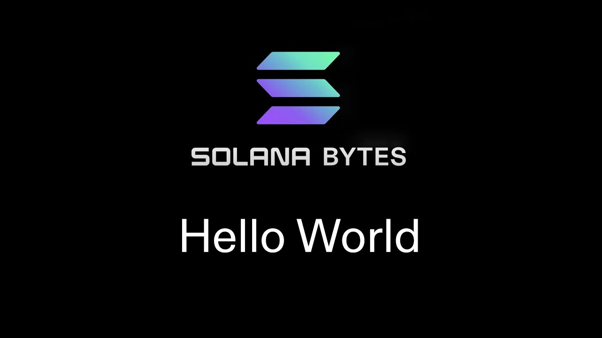

#  Introduction to Writing Solana Programs

In this section, the speaker introduces the process of writing a Solana program. They explain that a transaction consists of a list of signatures and a message containing instructions. These instructions are sent to programs on the Solana chain. The speaker also mentions the parameters involved in an instruction, such as the program ID and accounts.

## Understanding Transactions and Instructions

- A transaction consists of signatures and a message with instructions.
- Instructions are sent to programs on the Solana chain.
- Parameters in an instruction include program ID and accounts.

# [00:18](https://youtu.be/L1O0-VNrz7s?t=18) Implementing Programs using Rust

This section focuses on implementing programs using Rust for Solana. The speaker demonstrates how to use the Solana Playground IDE, a web-based IDE that eliminates the need for installing additional software. They show how to set up a new project and choose different frameworks for writing Solana programs.

## Using Solana Playground IDE

- Solana Playground IDE is a web-based IDE for writing Solana programs.
- No need to install Solana Rust Cargo or other dependencies.
- Set up a new project in Solana Playground IDE.
- Choose different frameworks for writing Solana programs.

# [01:20](https://youtu.be/L1O0-VNrz7s?t=80) Exploring Hello World Code

In this section, the speaker explores the "Hello World" code provided in Solana Playground IDE. They highlight the `process_instruction` function as the entry point of the program. This function receives instructions and performs actions based on them. The speaker explains how this function is marked as the entry point using a macro.

## Understanding `process_instruction` Function

- `process_instruction` function is marked as the entry point of the program.
- It receives instructions and performs actions based on them.
- Macro is used to mark the function as the entry point.

# [01:39](https://youtu.be/L1O0-VNrz7s?t=99) Adding Logic to Read and Manipulate Accounts

In this section, the speaker demonstrates how to add logic to read and manipulate accounts in a Solana program. They show how to iterate over a vector of account info types and render each one as an account info object. The speaker explains that public keys are retrieved by the runtime, and if successful, the accounts can be loaded into the code.

## Reading and Manipulating Accounts

- Iterate over a vector of account info types.
- Render each account as an account info object.
- Public keys are retrieved by the runtime.
- Successfully read accounts can be loaded into the code.

# [02:55](https://youtu.be/L1O0-VNrz7s?t=175) Deploying and Testing a Program

This section focuses on deploying and testing a Solana program. The speaker demonstrates how to deploy a program using Solana Playground IDE. They also show how to set up a connection to Devnet, create key pairs for payer and program ID, build instructions, sign transactions, and view program logs.

## Deploying and Testing Process

- Deploy a program using Solana Playground IDE.
- Set up connection to Devnet.
- Create key pairs for payer and program ID.
- Build instructions for transactions.
- Sign transactions with payer's key pair.
- View program logs using `Solana logs`.

[Generated with Video Highlight](https://videohighlight.com/video/summary/L1O0-VNrz7s)