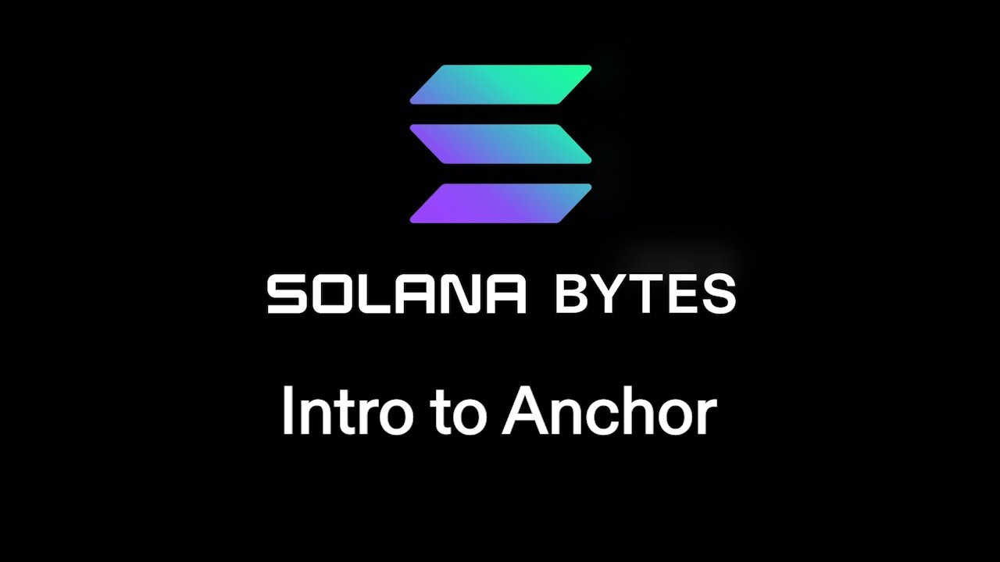

# [00:05](https://youtu.be/90BTugVYGqQ?t=5) Introduction to Anchor

Section Overview: In this section, the speaker introduces Anchor, a framework for building Solana programs. They mention that Anchor is a comprehensive framework and provide a link to its documentation.

## Building with Anchor

- The speaker recommends checking out Anchor as it is a massive framework for building Solana programs. 
- Anchor can be used instead of the native Solana program crate.
- The goal of this video is to convert code written using the native program crate into code using Anchor.
- The entry point in the code is now wrapped in a mod and super setup.
- Parameters like program ID and instruction data are handled differently in Anchor compared to the native implementation.
- Instead of passing in data, you dictate what the call to the program should do from the client side using an IDL (Interface Description Language).
- Accounts are added to a context struct in Anchor, replacing the list of accounts required in the native implementation.
- Decorators or annotations in Anchor handle tasks such as turning public keys into associated accounts and checking if an account can be borrowed as mutable.
- The anchor.toml file needs to be added with configurations for setting up an anchor test.

# [00:55](https://youtu.be/90BTugVYGqQ?t=55) Adding Accounts and Annotations

Section Overview: This section focuses on adding accounts and understanding annotations in an Anchor program.

## Adding Accounts

- Payer and system program accounts from the previous example are added to the struct in Anchor.
- The struct allows referencing fields by name instead of iterating through a list.
  
## Annotations

- Annotations play a crucial role behind-the-scenes in handling various tasks within Anchor.
- `derive accounts` annotation turns public keys into associated accounts with specific data types.
- An annotation ensures that an account can be borrowed as mutable if needed.

# [02:12](https://youtu.be/90BTugVYGqQ?t=132) Using IDL and Building with Anchor

Section Overview: This section explains how to use the IDL and demonstrates building with Anchor.

## IDL and Building

- The IDL (Interface Description Language) represents all the functions that a program can have.
- The IDL is used to dictate what the program should do from the client side.
- After building and deploying successfully, an IDL JSON file can be exported.
- The JSON file represents the program's name, version, and list of instructions it can perform.

## Using Anchor in Tests

- To use Anchor in tests, the anchor.toml file needs to be added with appropriate configurations.
- A provider object is used to take configurations from anchor.toml for setting up an anchor test.

Note: The transcript provided does not contain enough information to create additional sections.
# [05:36](https://youtu.be/90BTugVYGqQ?t=336) Introduction to Anchor

Section Overview: In this section, the speaker introduces the concept of Anchor and provides a beginner-level overview of its functionality.

## Function Execution with Anchor

- The function "hello" is used as an example.
- Required accounts are passed into the function.
- The payer account is used for signing the transaction.
- The transaction is sent using RPC.

## Using Anchor for Onchain Programs

- By invoking the function on the onchain program and passing in the required accounts, a response can be obtained.
- An example response is "hello salana".

Note: This section provides a basic understanding of Anchor. Further details will be covered in future discussions.

[Generated with Video Highlight](https://videohighlight.com/video/summary/90BTugVYGqQ)