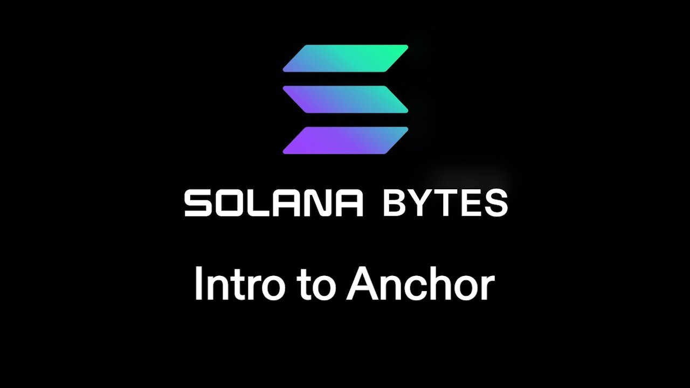

# [00:05](https://youtu.be/90BTugVYGqQ?t=5) Introduction to Anchor

Section Overview: In this section, the speaker introduces [Anchor](https://anchor-lang.com), a framework for building Solana programs. They mention that Anchor is a comprehensive framework and provide a link to its documentation.

## Building with Anchor

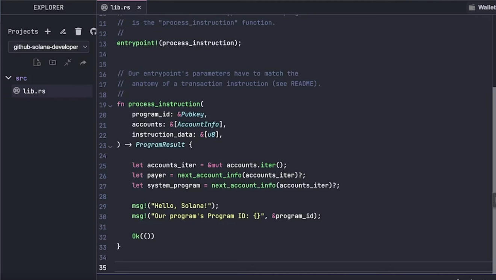

- The speaker recommends checking out [Anchor](https://anchor-lang.com) as it is a massive framework for building Solana programs. 
- Anchor can be used instead of the native Solana program crate.
- The goal of this video is to convert code written using the native program crate into code using Anchor.
- The entry point in the code is now wrapped in a mod and super setup.
- Parameters like program ID and instruction data are handled differently in Anchor compared to the native implementation.
- Instead of passing in data, you dictate what the call to the program should do from the client side using an IDL (Interface Description Language).
- Accounts are added to a context struct in Anchor, replacing the list of accounts required in the native implementation.
- Decorators or annotations in Anchor handle tasks such as turning public keys into associated accounts and checking if an account can be borrowed as mutable.
- The anchor.toml file needs to be added with configurations for setting up an anchor test.

# [00:55](https://youtu.be/90BTugVYGqQ?t=55) Adding Accounts and Annotations

Section Overview: This section focuses on adding accounts and understanding annotations in an Anchor program.

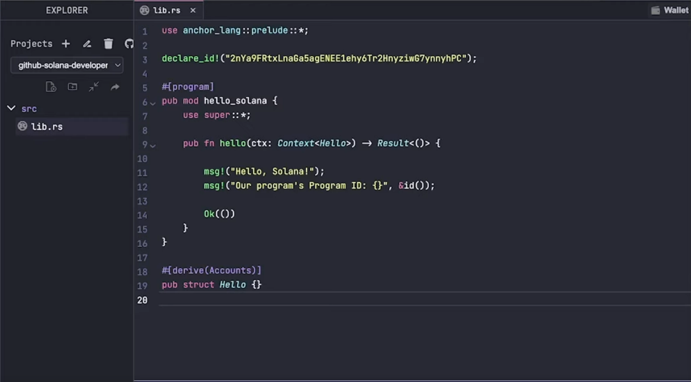

## Adding Accounts

- Payer and system program accounts from the previous example are added to the struct in Anchor.
- The struct allows referencing fields by name instead of iterating through a list.

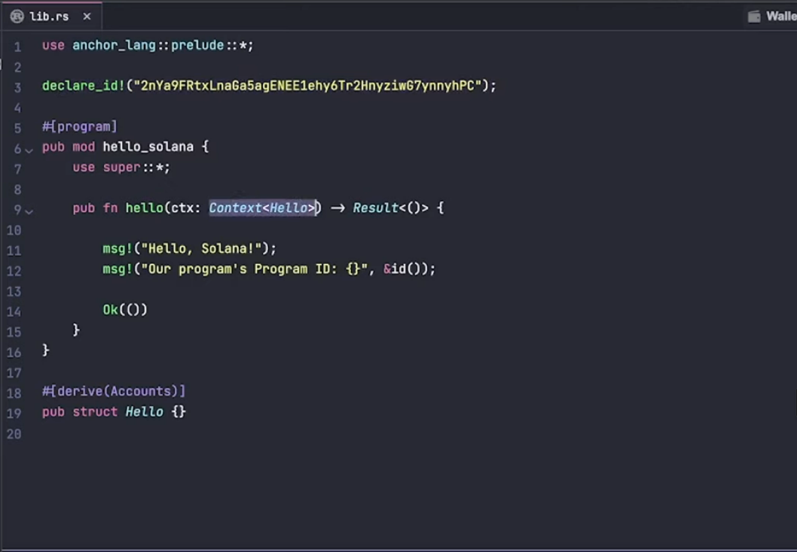

## Annotations

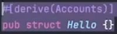

- Annotations play a crucial role behind-the-scenes in handling various tasks within Anchor.
- `derive accounts` annotation turns public keys into associated accounts with specific data types. (`#[account(mut)]`)
- An annotation ensures that an account can be borrowed as mutable if needed.  

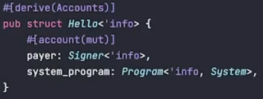

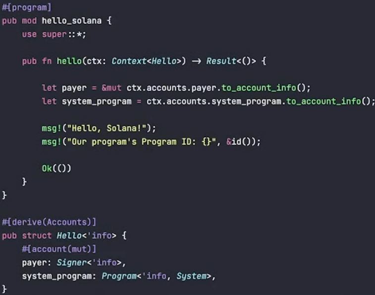

# [02:12](https://youtu.be/90BTugVYGqQ?t=132) Using IDL and Building with Anchor

Section Overview: This section explains how to use the IDL and demonstrates building with Anchor.

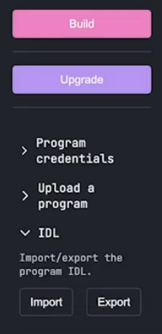

## IDL and Building

- The **IDL** (**Interface Description Language**) represents all the functions that a program can have.
- The IDL is used to dictate what the program should do from the client side.
- After building and deploying successfully, an IDL JSON file can be exported.
- The JSON file represents the program's name, version, and list of instructions it can perform.

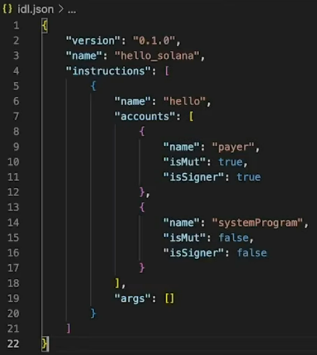

## Using Anchor in Tests

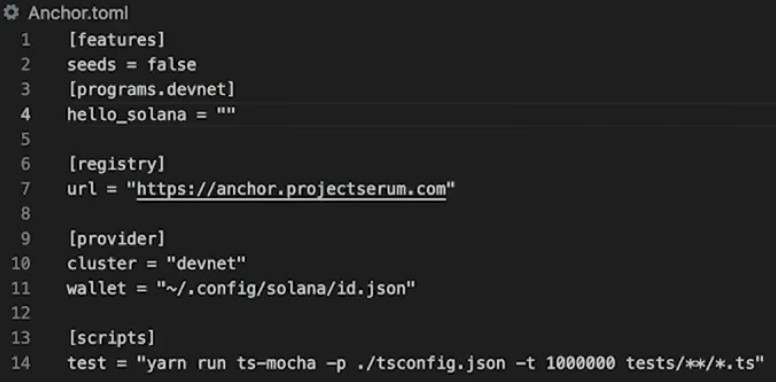

- To use Anchor in tests, the `anchor.toml` file needs to be added with appropriate configurations.
- A provider object is used to take configurations from `anchor.toml` for setting up an anchor test.

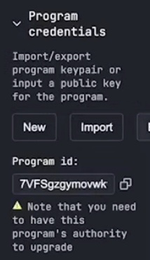

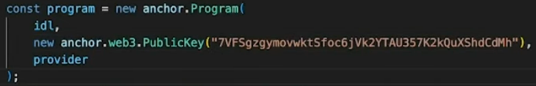

# [05:36](https://youtu.be/90BTugVYGqQ?t=336) Introduction to Anchor

Section Overview: In this section, the speaker introduces the concept of Anchor and provides a beginner-level overview of its functionality.

## Function Execution with Anchor

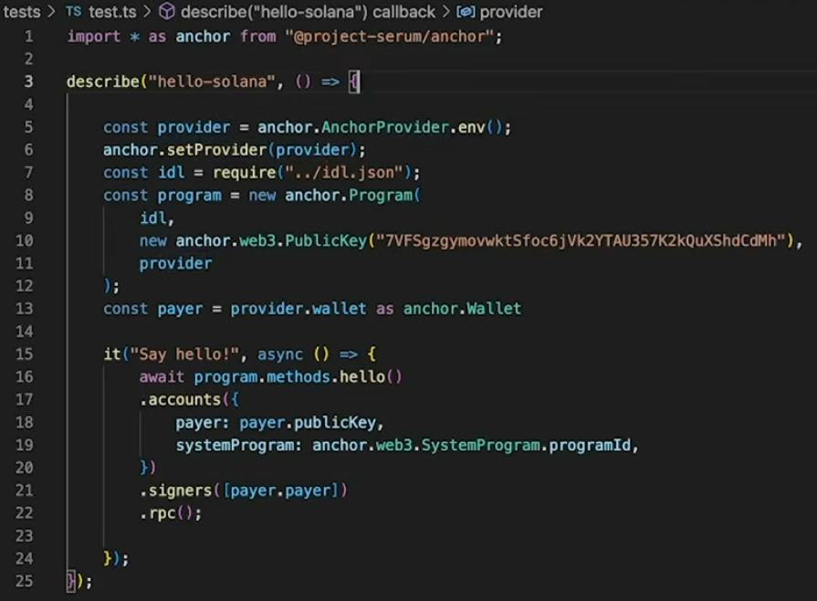

- The function "hello" is used as an example.
- Required accounts are passed into the function.
- The payer account is used for signing the transaction.
- The transaction is sent using RPC.

## Using Anchor for Onchain Programs

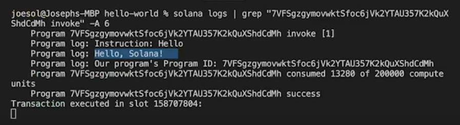

- By invoking the function on the onchain program and passing in the required accounts, a response can be obtained.
- An example response is "Hello, Solana!".

Note: This section provides a basic understanding of Anchor. Further details will be covered in future discussions.

[Generated with Video Highlight](https://videohighlight.com/video/summary/90BTugVYGqQ)

# Transcription

- [00:00:05](https://youtu.be/DRZogmD647U?t=5) ➜ we're going to take a look at building a
- [00:00:06](https://youtu.be/DRZogmD647U?t=6) ➜ hello world program using ankor and if
- [00:00:09](https://youtu.be/DRZogmD647U?t=9) ➜ you guys haven't heard of ankor yet you
- [00:00:11](https://youtu.be/DRZogmD647U?t=11) ➜ should definitely go check it out check
- [00:00:13](https://youtu.be/DRZogmD647U?t=13) ➜ out this page Anchor's docs because
- [00:00:15](https://youtu.be/DRZogmD647U?t=15) ➜ anchor is an absolutely massive
- [00:00:18](https://youtu.be/DRZogmD647U?t=18) ➜ framework to help with building salana
- [00:00:20](https://youtu.be/DRZogmD647U?t=20) ➜ programs Some people prefer it over
- [00:00:22](https://youtu.be/DRZogmD647U?t=22) ➜ salana programs crate it's completely up
- [00:00:24](https://youtu.be/DRZogmD647U?t=24) ➜ to you whatever you're comfortable with
- [00:00:26](https://youtu.be/DRZogmD647U?t=26) ➜ but in this video today we're going to
- [00:00:27](https://youtu.be/DRZogmD647U?t=27) ➜ cover the ins and outs of kind of what
- [00:00:29](https://youtu.be/DRZogmD647U?t=29) ➜ anchor does for you when you're writing
- [00:00:31](https://youtu.be/DRZogmD647U?t=31) ➜ a program with it so this is the code
- [00:00:34](https://youtu.be/DRZogmD647U?t=34) ➜ from another video where we wrote a
- [00:00:35](https://youtu.be/DRZogmD647U?t=35) ➜ hello world program using the salana
- [00:00:37](https://youtu.be/DRZogmD647U?t=37) ➜ program crate which is often called
- [00:00:40](https://youtu.be/DRZogmD647U?t=40) ➜ native instead of anchor now in this
- [00:00:43](https://youtu.be/DRZogmD647U?t=43) ➜ video what we're going to do is we're
- [00:00:44](https://youtu.be/DRZogmD647U?t=44) ➜ going to actually convert that code into
- [00:00:46](https://youtu.be/DRZogmD647U?t=46) ➜ what it would look like if we used
- [00:00:47](https://youtu.be/DRZogmD647U?t=47) ➜ anchor to create the exact same program
- [00:00:50](https://youtu.be/DRZogmD647U?t=50) ➜ and we'll talk about what's going on so
- [00:00:52](https://youtu.be/DRZogmD647U?t=52) ➜ this is it right here this is our anchor
- [00:00:54](https://youtu.be/DRZogmD647U?t=54) ➜ version of that exact same code except
- [00:00:56](https://youtu.be/DRZogmD647U?t=56) ➜ we don't have any of those accounts yet
- [00:00:58](https://youtu.be/DRZogmD647U?t=58) ➜ right so no payer no System Program
- [00:01:01](https://youtu.be/DRZogmD647U?t=61) ➜ We'll add those in in a sec first let's
- [00:01:04](https://youtu.be/DRZogmD647U?t=64) ➜ talk about some of the key differences
- [00:01:05](https://youtu.be/DRZogmD647U?t=65) ➜ that we see here so mainly that entry
- [00:01:08](https://youtu.be/DRZogmD647U?t=68) ➜ point that we previously had to Define
- [00:01:10](https://youtu.be/DRZogmD647U?t=70) ➜ with that macro is now wrapped in this
- [00:01:12](https://youtu.be/DRZogmD647U?t=72) ➜ mod and super setup up here and now
- [00:01:15](https://youtu.be/DRZogmD647U?t=75) ➜ arguably most importantly is what
- [00:01:17](https://youtu.be/DRZogmD647U?t=77) ➜ happened to those parameters that we
- [00:01:19](https://youtu.be/DRZogmD647U?t=79) ➜ originally had to work with right so
- [00:01:21](https://youtu.be/DRZogmD647U?t=81) ➜ program ID we're instead using declare
- [00:01:24](https://youtu.be/DRZogmD647U?t=84) ➜ ID that's not a huge deal but what
- [00:01:26](https://youtu.be/DRZogmD647U?t=86) ➜ happened to the list of accounts that we
- [00:01:27](https://youtu.be/DRZogmD647U?t=87) ➜ previously required or the instruction
- [00:01:30](https://youtu.be/DRZogmD647U?t=90) ➜ data that we had to parse out so that we
- [00:01:32](https://youtu.be/DRZogmD647U?t=92) ➜ know what this thing is supposed to do
- [00:01:34](https://youtu.be/DRZogmD647U?t=94) ➜ well the list of accounts is still here
- [00:01:37](https://youtu.be/DRZogmD647U?t=97) ➜ and that's actually what this context
- [00:01:38](https://youtu.be/DRZogmD647U?t=98) ➜ struct is for right here so we're going
- [00:01:40](https://youtu.be/DRZogmD647U?t=100) ➜ to fill this out in a second but this is
- [00:01:42](https://youtu.be/DRZogmD647U?t=102) ➜ where our accounts are instead going to
- [00:01:44](https://youtu.be/DRZogmD647U?t=104) ➜ go and then our instruction data instead
- [00:01:47](https://youtu.be/DRZogmD647U?t=107) ➜ of passing in data that we then have to
- [00:01:50](https://youtu.be/DRZogmD647U?t=110) ➜ parse and serialize and determine what
- [00:01:53](https://youtu.be/DRZogmD647U?t=113) ➜ we're supposed to do you instead dictate
- [00:01:57](https://youtu.be/DRZogmD647U?t=117) ➜ what you want this actual call to the
- [00:01:59](https://youtu.be/DRZogmD647U?t=119) ➜ program to do from the client side using
- [00:02:02](https://youtu.be/DRZogmD647U?t=122) ➜ what's called an IDL and it's basically
- [00:02:04](https://youtu.be/DRZogmD647U?t=124) ➜ just a representation of all of these
- [00:02:06](https://youtu.be/DRZogmD647U?t=126) ➜ functions that you could possibly have
- [00:02:09](https://youtu.be/DRZogmD647U?t=129) ➜ in a program we will see that very soon
- [00:02:12](https://youtu.be/DRZogmD647U?t=132) ➜ in the meantime let's go ahead and add
- [00:02:13](https://youtu.be/DRZogmD647U?t=133) ➜ our accounts to the struct here and
- [00:02:15](https://youtu.be/DRZogmD647U?t=135) ➜ let's talk about what's going on here
- [00:02:17](https://youtu.be/DRZogmD647U?t=137) ➜ all right so as you can see we just
- [00:02:19](https://youtu.be/DRZogmD647U?t=139) ➜ tossed in our payer and our system
- [00:02:21](https://youtu.be/DRZogmD647U?t=141) ➜ program from the previous example and
- [00:02:24](https://youtu.be/DRZogmD647U?t=144) ➜ now what this struct is going to
- [00:02:25](https://youtu.be/DRZogmD647U?t=145) ➜ actually do is obviously the first
- [00:02:27](https://youtu.be/DRZogmD647U?t=147) ➜ difference is it's no longer a list
- [00:02:29](https://youtu.be/DRZogmD647U?t=149) ➜ right it's a construct you can reference
- [00:02:31](https://youtu.be/DRZogmD647U?t=151) ➜ the fields by name so you don't have to
- [00:02:33](https://youtu.be/DRZogmD647U?t=153) ➜ iterate already kind of a plus and then
- [00:02:36](https://youtu.be/DRZogmD647U?t=156) ➜ these decorators here or annotations
- [00:02:39](https://youtu.be/DRZogmD647U?t=159) ➜ that you see are actually responsible
- [00:02:41](https://youtu.be/DRZogmD647U?t=161) ➜ for a number of different things that
- [00:02:43](https://youtu.be/DRZogmD647U?t=163) ➜ anchor will do for you behind the scenes
- [00:02:46](https://youtu.be/DRZogmD647U?t=166) ➜ so the first one here derive accounts
- [00:02:48](https://youtu.be/DRZogmD647U?t=168) ➜ this is going to turn all of these
- [00:02:50](https://youtu.be/DRZogmD647U?t=170) ➜ public Keys into their Associated
- [00:02:52](https://youtu.be/DRZogmD647U?t=172) ➜ accounts with whatever kind of data that
- [00:02:54](https://youtu.be/DRZogmD647U?t=174) ➜ they're supposed to have right so this
- [00:02:55](https://youtu.be/DRZogmD647U?t=175) ➜ one's going to be the system program
- [00:02:57](https://youtu.be/DRZogmD647U?t=177) ➜ it's going to be a program with data
- [00:02:59](https://youtu.be/DRZogmD647U?t=179) ➜ type typ of system this one's going to
- [00:03:01](https://youtu.be/DRZogmD647U?t=181) ➜ be a signer and then this particular
- [00:03:04](https://youtu.be/DRZogmD647U?t=184) ➜ annotation here will actually check to
- [00:03:07](https://youtu.be/DRZogmD647U?t=187) ➜ make sure that this account here is
- [00:03:10](https://youtu.be/DRZogmD647U?t=190) ➜ allowed to be borrowed as mutable right
- [00:03:13](https://youtu.be/DRZogmD647U?t=193) ➜ so in this case if our payer is signing
- [00:03:16](https://youtu.be/DRZogmD647U?t=196) ➜ this transaction and we're passing in
- [00:03:18](https://youtu.be/DRZogmD647U?t=198) ➜ the payer's public key we're saying that
- [00:03:21](https://youtu.be/DRZogmD647U?t=201) ➜ this thing is the signer right like this
- [00:03:23](https://youtu.be/DRZogmD647U?t=203) ➜ account is the signer so in the previous
- [00:03:25](https://youtu.be/DRZogmD647U?t=205) ➜ example where we saw it on our client
- [00:03:28](https://youtu.be/DRZogmD647U?t=208) ➜ side when we hit this program with the
- [00:03:30](https://youtu.be/DRZogmD647U?t=210) ➜ transaction we declared that the payer
- [00:03:32](https://youtu.be/DRZogmD647U?t=212) ➜ was not only the signer but also mutable
- [00:03:37](https://youtu.be/DRZogmD647U?t=217) ➜ with anchor you do that on your program
- [00:03:39](https://youtu.be/DRZogmD647U?t=219) ➜ side and then this of course right here
- [00:03:41](https://youtu.be/DRZogmD647U?t=221) ➜ is how you actually reference those
- [00:03:42](https://youtu.be/DRZogmD647U?t=222) ➜ accounts you can see we're borrowing
- [00:03:44](https://youtu.be/DRZogmD647U?t=224) ➜ payer as mutable and here we can
- [00:03:46](https://youtu.be/DRZogmD647U?t=226) ➜ actually convert those right to account
- [00:03:49](https://youtu.be/DRZogmD647U?t=229) ➜ info which is the same account info
- [00:03:51](https://youtu.be/DRZogmD647U?t=231) ➜ struct that we saw on the native
- [00:03:52](https://youtu.be/DRZogmD647U?t=232) ➜ implementation but anyway let's go ahead
- [00:03:54](https://youtu.be/DRZogmD647U?t=234) ➜ and build this thing with SOG and let's
- [00:03:56](https://youtu.be/DRZogmD647U?t=236) ➜ see what the client side looks like when
- [00:03:58](https://youtu.be/DRZogmD647U?t=238) ➜ you use anchor so once once this thing
- [00:04:00](https://youtu.be/DRZogmD647U?t=240) ➜ has built and deployed successfully we
- [00:04:02](https://youtu.be/DRZogmD647U?t=242) ➜ can actually go ahead and go to this IDL
- [00:04:05](https://youtu.be/DRZogmD647U?t=245) ➜ Tab and we can click export and you can
- [00:04:08](https://youtu.be/DRZogmD647U?t=248) ➜ see It'll download this Json file and we
- [00:04:10](https://youtu.be/DRZogmD647U?t=250) ➜ can drop it in our test right here and
- [00:04:14](https://youtu.be/DRZogmD647U?t=254) ➜ when we do that we see that this is
- [00:04:16](https://youtu.be/DRZogmD647U?t=256) ➜ actually a Json representation of our
- [00:04:19](https://youtu.be/DRZogmD647U?t=259) ➜ program right so like here's the name
- [00:04:21](https://youtu.be/DRZogmD647U?t=261) ➜ and version and then the list of
- [00:04:23](https://youtu.be/DRZogmD647U?t=263) ➜ instructions that are possible for this
- [00:04:25](https://youtu.be/DRZogmD647U?t=265) ➜ program to do we only wrote one it was
- [00:04:27](https://youtu.be/DRZogmD647U?t=267) ➜ our hello function but as you you can
- [00:04:29](https://youtu.be/DRZogmD647U?t=269) ➜ see there's both of the accounts that we
- [00:04:32](https://youtu.be/DRZogmD647U?t=272) ➜ require for this instruction and there
- [00:04:34](https://youtu.be/DRZogmD647U?t=274) ➜ it is is mute is serer right just like
- [00:04:37](https://youtu.be/DRZogmD647U?t=277) ➜ we saw in Native but anchor has
- [00:04:39](https://youtu.be/DRZogmD647U?t=279) ➜ generated this stuff for us so how do we
- [00:04:42](https://youtu.be/DRZogmD647U?t=282) ➜ use this in our test well the first
- [00:04:44](https://youtu.be/DRZogmD647U?t=284) ➜ thing we have to do is actually add this
- [00:04:45](https://youtu.be/DRZogmD647U?t=285) ➜ anchor. toml file and as you can see
- [00:04:47](https://youtu.be/DRZogmD647U?t=287) ➜ there's just a number of different
- [00:04:49](https://youtu.be/DRZogmD647U?t=289) ➜ configs for our anchor setup we want to
- [00:04:51](https://youtu.be/DRZogmD647U?t=291) ➜ make sure we're pointed at devet we got
- [00:04:52](https://youtu.be/DRZogmD647U?t=292) ➜ our local key pair right here and then
- [00:04:55](https://youtu.be/DRZogmD647U?t=295) ➜ we want to add our program's ID so
- [00:04:58](https://youtu.be/DRZogmD647U?t=298) ➜ flipping back to program credential we
- [00:05:00](https://youtu.be/DRZogmD647U?t=300) ➜ just copy that save it and then we can
- [00:05:03](https://youtu.be/DRZogmD647U?t=303) ➜ open up our test where we're also going
- [00:05:05](https://youtu.be/DRZogmD647U?t=305) ➜ to add our program ID right here and as
- [00:05:07](https://youtu.be/DRZogmD647U?t=307) ➜ you can see now to set up an anchor test
- [00:05:10](https://youtu.be/DRZogmD647U?t=310) ➜ we actually have this provider object
- [00:05:12](https://youtu.be/DRZogmD647U?t=312) ➜ here which is just going to basically
- [00:05:13](https://youtu.be/DRZogmD647U?t=313) ➜ take all of those configs from anchor.
- [00:05:15](https://youtu.be/DRZogmD647U?t=315) ➜ toml and set them up in this test Suite
- [00:05:19](https://youtu.be/DRZogmD647U?t=319) ➜ this is the IDL that we're using from
- [00:05:20](https://youtu.be/DRZogmD647U?t=320) ➜ the Json file and as you can see we use
- [00:05:23](https://youtu.be/DRZogmD647U?t=323) ➜ that to build this program object and
- [00:05:26](https://youtu.be/DRZogmD647U?t=326) ➜ now this object right here will actually
- [00:05:28](https://youtu.be/DRZogmD647U?t=328) ➜ allow us to interact with our onchain
- [00:05:31](https://youtu.be/DRZogmD647U?t=331) ➜ program as if it was just a regular
- [00:05:33](https://youtu.be/DRZogmD647U?t=333) ➜ typescript object and this is what I
- [00:05:35](https://youtu.be/DRZogmD647U?t=335) ➜ mean down here you can see that if we do
- [00:05:37](https://youtu.be/DRZogmD647U?t=337) ➜ program. methods. hello this is the name
- [00:05:41](https://youtu.be/DRZogmD647U?t=341) ➜ of our function that we wrote so here's
- [00:05:44](https://youtu.be/DRZogmD647U?t=344) ➜ the required accounts that we pass in
- [00:05:46](https://youtu.be/DRZogmD647U?t=346) ➜ we're going to sign it with our payer
- [00:05:48](https://youtu.be/DRZogmD647U?t=348) ➜ which is just going to be the local
- [00:05:49](https://youtu.be/DRZogmD647U?t=349) ➜ config like local wallet and then we're
- [00:05:52](https://youtu.be/DRZogmD647U?t=352) ➜ going to send this transaction by just
- [00:05:54](https://youtu.be/DRZogmD647U?t=354) ➜ doing RPC and that's all it takes and
- [00:05:57](https://youtu.be/DRZogmD647U?t=357) ➜ now we can hit that function on our
- [00:05:59](https://youtu.be/DRZogmD647U?t=359) ➜ onchain program pass in these two
- [00:06:01](https://youtu.be/DRZogmD647U?t=361) ➜ accounts and get a
- [00:06:04](https://youtu.be/DRZogmD647U?t=364) ➜ response hello salana and there you go
- [00:06:07](https://youtu.be/DRZogmD647U?t=367) ➜ guys that's anchor at a very beginner
- [00:06:10](https://youtu.be/DRZogmD647U?t=370) ➜ level overview we will see a lot more of
- [00:06:12](https://youtu.be/DRZogmD647U?t=372) ➜ it in the future but those are some of
- [00:06:14](https://youtu.be/DRZogmD647U?t=374) ➜ the basic reasons why you may want to
- [00:06:16](https://youtu.be/DRZogmD647U?t=376) ➜ use it or may not but either way it's a
- [00:06:18](https://youtu.be/DRZogmD647U?t=378) ➜ powerful tool they did a great job at
- [00:06:20](https://youtu.be/DRZogmD647U?t=380) ➜ Coral and I encourage you guys to at
- [00:06:22](https://youtu.be/DRZogmD647U?t=382) ➜ least take a look at it and see what you think later

