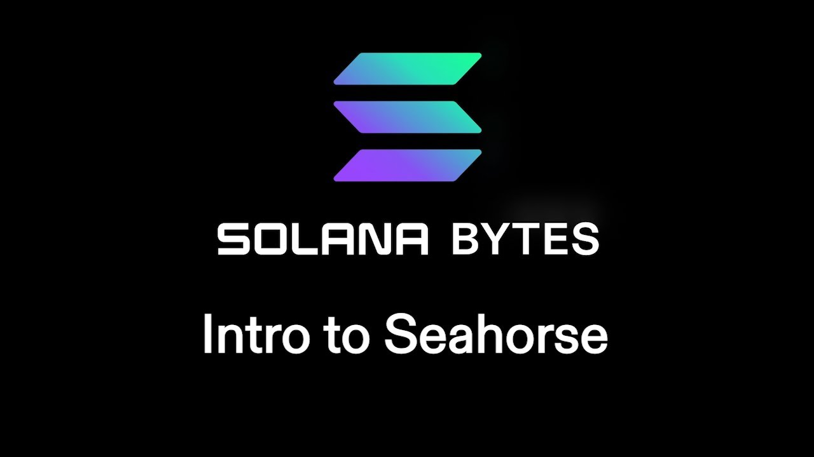

# [00:05](https://youtu.be/Wt3kcIb98Do?t=5) Introduction to Seahorse Framework

Section Overview: In this section, the speaker introduces the Seahorse framework, which allows writing Solana programs in Python.

## What is Seahorse?

- Seahorse is a framework that enables writing Solana programs in Python.
- It is built on top of Anchor, which is also built on top of Solana program and other crates.
- By using Seahorse, traditional Python code can be written with the ability to convert functions into instructions with context, similar to Anchor.

# [00:23](https://youtu.be/Wt3kcIb98Do?t=23) Hello World Program in Seahorse

Section Overview: This section demonstrates a Hello World program written in Seahorse and explains its underlying structure.

## Structure of the Hello World Program

- The program starts by importing the `seahorse Prelude` module.
- A function called `declare ID` is used to pass accounts as parameters.
- Business logic can be implemented below this function.
- An annotation instruction converts the function into an instruction with context, similar to Anchor.

# [00:43](https://youtu.be/Wt3kcIb98Do?t=43) Exploring Seahorse Code in VS Code

Section Overview: This section explores the code structure of a Seahorse program using VS Code.

## Viewing Rust Code Generated by Seahorse CLI

- After running `seahorse build`, the generated code can be found in the `programs` folder.
- The Rust code corresponds to what was written in Python using Seahorse.
- This allows developers to write Solana programs either in Python or Rust while leveraging each language's strengths.

# [01:21](https://youtu.be/Wt3kcIb98Do?t=81) Exploring Additional Files and Features

Section Overview: This section highlights additional files and features available within the Seahorse repository.

## Exploring Prelude Module and Data Types

- The `Prelude` module contains various data types and functions provided by Seahorse.
- These are constantly being updated as Seahorse is a new project.

## Correspondence to Anchor Repository

- Since Seahorse is built on top of Anchor, the repository structure includes familiar elements like an `anchor.toml` file and a program workspace for Cargo.
- Tests can be written in TypeScript using the Anchor npm SDK.

# [01:57](https://youtu.be/Wt3kcIb98Do?t=117) Writing Tests with Seahorse

Section Overview: This section demonstrates writing tests for a Seahorse program using the Anchor framework.

## Writing an Anchor Test

- A test can be written using the same setup and functions as demonstrated in previous Anchor videos.
- The test code closely resembles what was designed with Seahorse, allowing developers to seamlessly transition from Python to Rust when working with Solana programs.

# [02:19](https://youtu.be/Wt3kcIb98Do?t=139) Running and Verifying the Program

Section Overview: This section shows how to run and verify a Seahorse program using the Anchor framework.

## Running the Test

- After connecting to Devnet using local configuration, the test can be executed by running build and deploy commands.
- The IDL (Interface Definition Language) is downloaded from Anchor.
- The program's ID is added to anchor.toml.
- The public key for the program is included, and the test is initiated.

# [04:10](https://youtu.be/Wt3kcIb98Do?t=250) Conclusion and Call for Contributions

Section Overview: In this final section, the speaker concludes by encouraging contributions to the Seahorse project.

## Final Thoughts on Seahorse Lang

- Seahorse Lang allows developers to write Solana programs in Python or Rust while leveraging each language's strengths.
- Developers who are more comfortable with Python can use it as a stepping stone towards learning Rust and building with Anchor.

## Contributing to Seahorse Project

- Viewers are encouraged to contribute to the Seahorse project by forking it on GitHub and helping bring its potential to life.
- The repository link is provided for easy access.

[Generated with Video Highlight](https://videohighlight.com/video/summary/Wt3kcIb98Do)