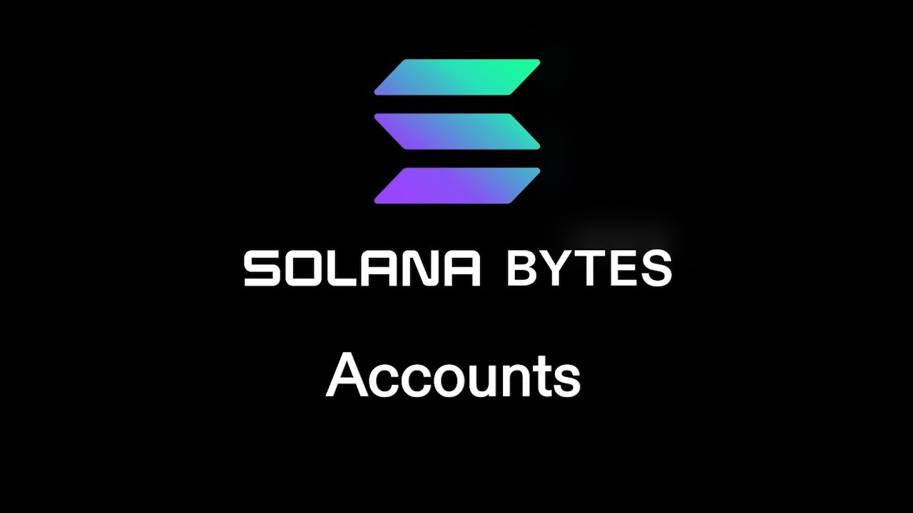

# [00:05](https://youtu.be/0_j0rQ9Bvks?t=5) Understanding Accounts on Solana

Section Overview: In this section, the speaker introduces the concept of accounts on Solana and explains key elements such as ownership, signers, and programs.

## Account Structure

- The public key represents the account's address.
- The balance indicates the amount of Soul (the native currency) in the account.
- The "own" field refers to the program ID associated with the account. If marked as executable, it means the account contains a program that can be executed as a smart contract or program.

## Rent and Ownership

- Rent is periodically due on an account based on its storage size.
- The owner field represents the program ID that owns the account.
- The system program is responsible for creating new accounts and changing ownership.

## Changing Ownership

- An account is initially owned by the system program.
- To change ownership, a client signs a transaction with their private key and sends instructions to the target program.
- The target program verifies ownership and authorization before modifying data.

## Creating New Accounts

- The system program is responsible for creating new accounts.
- To create an account, a user generates a new key pair and registers it with the system program.
- A debit from their original account pays for rent and assigns ownership to the system program.

## Changing Ownership in One Step

- Using Solana Web3.js, one can create an instruction to change ownership in one step by specifying a different program ID.

Note: This summary provides an overview of understanding accounts on Solana. For more detailed information, refer to specific sections of the transcript using timestamps.

[Generated with Video Highlight](https://videohighlight.com/video/summary/0_j0rQ9Bvks)