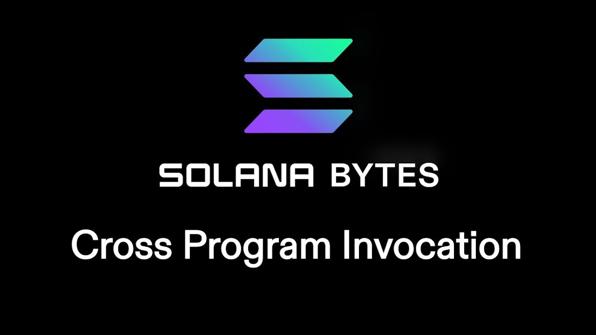

# [00:06](https://youtu.be/re1O2D_qqTA?t=6) Cross Program Invocations (CPIs)

Section Overview: In this section, the speaker introduces the concept of cross program invocations (CPIs), which involve using one program to invoke another program.

## CPI Basics

- **CPI** stands for **Cross Program Invocation**.
- It refers to using one program to invoke another program.
- This is useful when a program needs to perform an operation that it cannot do on its own.
- By creating a new instruction in the program, another program can be invoked at runtime.

## Using CPI in Code

- The `invoke` keyword is used to initiate a CPI from within a program.
- The `invoke` keyword allows the current program to call and execute instructions from another program.
- An example is shown where a CPI is used to create an account by invoking the system instruction `create account`.
- The returned instruction can be sent over to the other program for processing.

## Native vs Anchor

### Native

- For Native programs, only the `invoke` keyword is needed for CPIs.
- Rust library functions help build instructions for different programs.

### Anchor

- Anchor also supports CPIs but uses what's called "CPI context".
- Anchor programs use context structs and embedded structs to create instructions for cross-program invocations.
- Context structs are set up specifically for handling cross-program invocations in Anchor programs.

# [03:00](https://youtu.be/re1O2D_qqTA?t=180) Conclusion

Section Overview: In this section, the speaker concludes by highlighting the power of cross-program invocations and their usefulness in various use cases involving ownership or constraints.

[Generated with Video Highlight](https://videohighlight.com/video/summary/re1O2D_qqTA)