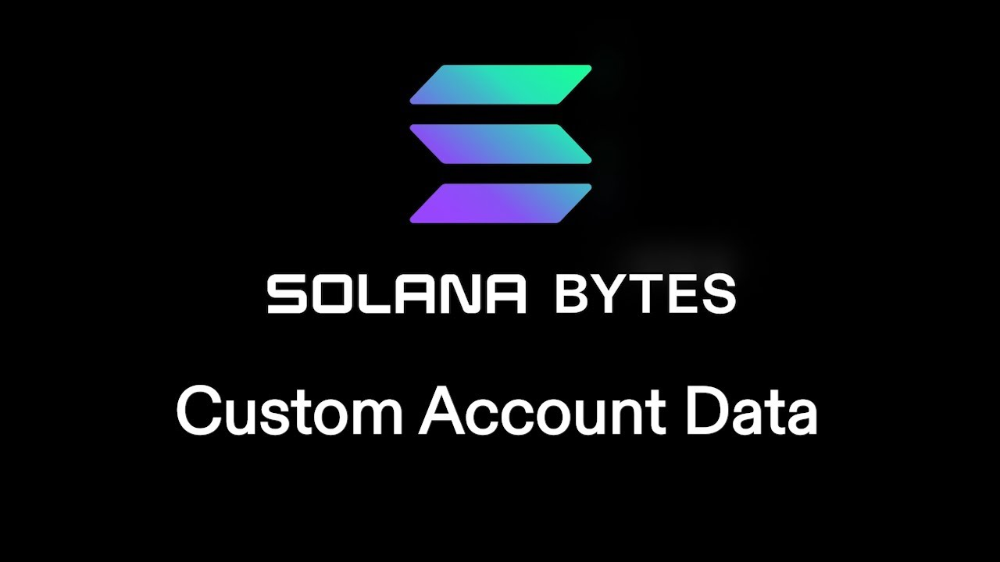

# [00:05](https://youtu.be/SCS6jt8sye0?t=5) Creating Custom Data for Accounts

Section Overview: In this section, we will learn how to create custom data types and fields for accounts in Rust.

## Repository Structure

- The repository structure includes an "instructions" and "State" folder.
- The "processor" file contains the instruction to create an address info account.
- The "address info" file in the State folder defines the struct representing the custom data.

## Serialization and Deserialization

- An annotation for serialization and deserialization allows converting the Rust struct into bytes.
- This enables conversion between Rust struct and TypeScript on the client side.

## Rent Calculation

- Rent needs to be paid for storing data on an account.
- To make an account rent exempt, two years of rent need to be calculated based on the size of the data.

## Creating Account with Custom Data

- Set specific rent and size values for the account.
- Serialize the custom data into the account using Bor serialization.

## Test Components

- An assignable class allows dynamic mapping of fields.
- Address info is created by extending assignable and adding buffer functions for byte conversion.
- A schema maps TypeScript implementation to Rust representation.

# [05:16](https://youtu.be/SCS6jt8sye0?t=316) Setting up Custom Data

Section Overview: In this section, we will learn how to set up custom data in a program.

## Native Version

- The test for custom data passed successfully.
- Custom data is displayed as expected.
- This is the process for setting up custom data in a native version.

## Anchor Version

- The anchor version of setting up custom data is similar to the native version.
- The state folder, instructions folder, and lib RS are present.
- In the state folder, Bor is not needed but another element is added.
- In the create function, there are some differences compared to the native version.

## Create Function Differences

- Rent calculation remains the same.
- Cross-program invocation is used to create the account.
- Instead of using serialization method, `set_iner` method is used.
- The address info object is taken as input and set up on-chain.
- Account data is set to the address info object.
- Address info is specified as the data type of this account in Ankor context.

# [05:31](https://youtu.be/SCS6jt8sye0?t=331) Exploring Anchor Version

Section Overview: In this section, we will explore the anchor version of setting up custom data further.

## Create Function Details

- Rent calculation remains unchanged from previous versions.
- Cross-program invocation creates an account using input parameters.
- `zet_iner` method replaces serialization method for setting up on-chain object.
- Account data is assigned to address info object received as input parameter.
- Address info datatype specified in Ankor context.

[Generated with Video Highlight](https://videohighlight.com/video/summary/SCS6jt8sye0)