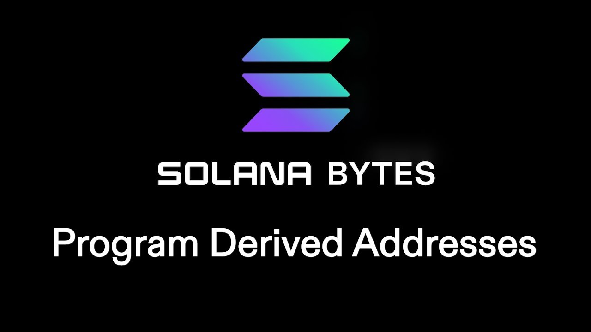

# [00:05](https://youtu.be/ZwFNPvqUclM?t=5) Introduction to Program Derived Addresses (PDAs)

Section Overview: In this section, the speaker introduces the concept of **Program Derived Addresses** (**PDAs**) in Solana and explains their significance.

## Understanding PDAs

- PDAs allow for changes to be made to an account without requiring the program that owns the account or the client to authorize the change.
- PDAs mimic the behavior of a web 2 app that can read and write from its own database at any time.
- PDAs are created using seeds instead of private keys, and these seeds are used to sign for changes.

# [01:21](https://youtu.be/ZwFNPvqUclM?t=81) Exploring PDA Implementation

Section Overview: This section dives into the implementation details of PDAs in Solana, including bumping and managing bumps throughout the program.

## Key Concepts

- **Bump** is an important concept for PDAs. It ensures that a public key derived from seeds does not have an associated private key.
- The **Ed25519 curve** is used to determine if a public key has an associated private key. If it exists on this curve, it could have a private key.
- To prevent having a private key, Solana adds an additional integer called "bump" to bump off the curve.
- Managing bumps throughout the program is crucial. It can be stored in account data or used for other purposes.

# [02:30](https://youtu.be/ZwFNPvqUclM?t=150) Creating and Incrementing Page Visits with PDAs

Section Overview: This section demonstrates how to create a program using PDAs to record page visits by users.

## Implementation Steps

1. Define a struct representing PDA's data, including page visits count.
2. Use seeds (strings) and user's public key to derive PDA's address using `public_key.find_program_address`.
3. Create instructions to create the PDA and increment page visits.
4. Test the program by creating a test user account, deriving the PDA, and incrementing page visits.
5. Retrieve and display the updated data from the PDA.

# [04:16](https://youtu.be/ZwFNPvqUclM?t=256) Testing and Logging

Section Overview: This section covers testing the program and checking logs for successful invocations.

## Testing Steps

1. Set up test data and instructions.
2. Create a test user account.
3. Derive the PDA using `public_key.find_program_address`.
4. Invoke instructions to create the PDA and increment page visits.
5. Check logs for successful invocations.

Note: The transcript does not provide specific details about what is logged or how to interpret log results.

# [05:30](https://youtu.be/ZwFNPvqUclM?t=330) Embedded Method for Getting Bump from Account Seed

Section Overview: The speaker discusses an embedded method to retrieve a bump from a specific account based on its seed. This method proves to be useful in the context of creating and running a CPI (Cross-Program Invocation) from the given context struct.

## Retrieving Bump with Account Seed

- An embedded method is used to obtain a bump from a particular account based on its seed.
- This method is convenient for creating and running a CPI using the context struct.

# [05:47](https://youtu.be/ZwFNPvqUclM?t=347) Running Checks Against Seeds

Section Overview: The speaker explains that it is possible to run checks against seeds provided in a mute, ensuring that the public key was derived from these seeds.

## Incrementing with Context Struct

- Incrementing also follows a similar pattern, where we reference it from the context struct.
- The key aspect here is that checks can be performed against these seeds when they are provided in a mute.
- These checks verify if the public key was derived from the specified seeds.

[Generated with Video Highlight](https://videohighlight.com/video/summary/ZwFNPvqUclM)