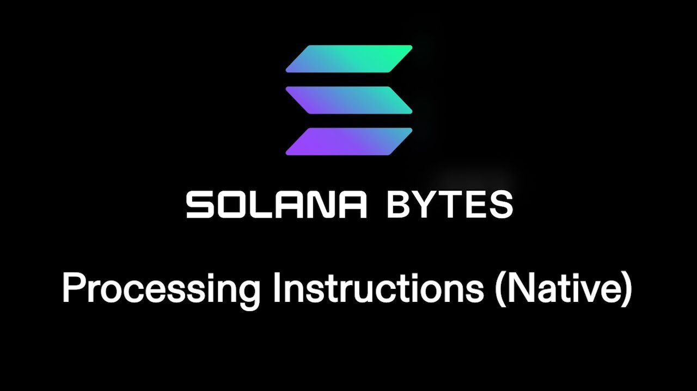

# [00:05](https://youtu.be/T5p8rGD0-vs?t=5) Processing Instructions with Native Solana Programs

Section Overview: In this section, we will explore processing instructions with Native Solana programs. We will learn how to build and decipher instructions, as well as kick off operations based on instruction data.

## Initializing a Journal Program
- The Journal program operates similarly to a PDA (Personal Digital Assistant).
- We initialize a journal PDA and write new entries to it.
- Each entry is derived from the journal and contains a message.

## Instruction Structure
- Instructions have different types that determine the operation of the program.
- The `initJournal` file initializes a journal by setting up the instruction data using an enum variant.
- The `newEntry` file creates a new entry in the journal using another enum variant.

## Enum Variants for Instructions
- The enum defines two types of instructions that the program can support.
- On the Rust side, these variants are represented as integers (0 and 1).
- In the `processInstruction` function, we match the received instruction type and pass its arguments to the corresponding instruction function.

## Instruction Functions
- Each instruction function receives specific arguments based on its variant.
- For example, in `initJournal`, we receive `initJournalArgs` which contains additional fields besides the enum variant.
- These arguments are used to perform operations within each instruction function.

# [05:11](https://youtu.be/T5p8rGD0-vs?t=311) Processing Instructions using Borch and Serialization

Section Overview: In this section, the speaker explains how to process instructions using Borch and serialization.

## Serializing Instructions

- To serialize an instruction field that represents different kinds of instructions in a program, set it equal to a variant of a particular enum.
- Determine which variant is being used (e.g., 0 for the first enum variant, 1 for the second).
- Serialize the instruction by grabbing the input associated with that variant.

## Example Test

- Initialize the journal and write a few entries.
- Kick off the operation with the rest of the arguments.
- The test is successful, demonstrating how to process instructions using Borch and serialization.

[05:11](https://youtu.be/T5p8rGD0-vs?t=311)

## Conclusion

Processing instructions using Borch and serialization is straightforward. By setting an instruction field equal to a specific enum variant and serializing it accordingly, you can easily determine which operation to perform. The provided example test showcases this process effectively.

[Generated with Video Highlight](https://videohighlight.com/video/summary/T5p8rGD0-vs)