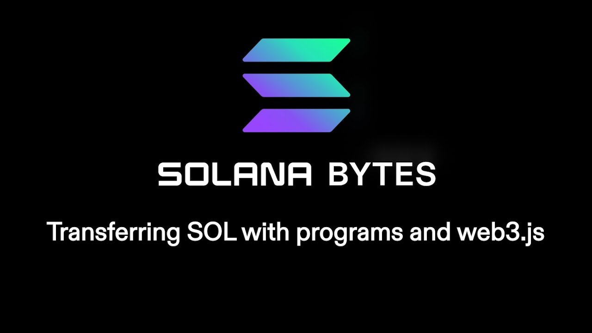

# [00:05](https://youtu.be/hDiEv2a7VC0?t=5) Transfer Methods - Client Side

Section Overview: In this section, the speaker discusses different ways to transfer Soul. The first method explored is transferring Soul from the client side using web3.js.

## Client Side Transfer

- **Use web3.js** on the **client side** to set up instructions for transferring Soul.
- **Create** a new **key pair** for the transfer.
- Utilize the **system program**'s transfer function to obtain an **instruction**.
- **Send a transaction** with the generated instruction to complete the transfer.

# [00:18](https://youtu.be/hDiEv2a7VC0?t=18) Transfer Methods - Onchain

Section Overview: This section focuses on onchain transfer methods and introduces two types of instructions for transferring Soul.

## CPI Transfer vs Program Transfer

- Two types of instructions can be used for transferring Soul onchain: CPI and program transfers.
- **CPI** transfers involve sending instructions to the system program, which then executes the transfer.
- **Program transfers** allow a program to directly modify its own account's balance by referencing and interacting with lamp ports.

# [01:09](https://youtu.be/hDiEv2a7VC0?t=69) CPI Transfer Example

Section Overview: This section provides an example of how to perform a CPI transfer using invoke classical CPI operation.

## Steps for CPI Transfer

- **Set up instruction metadata** to direct the type of transfer (CPI in this case).
- **Create an instruction** using the transfer instruction from system instruction.
- **Test** the CPI transfer by setting up a recipient account and confirming the transaction.

# [02:16](https://youtu.be/hDiEv2a7VC0?t=136) Program Transfer Example

Section Overview: This section demonstrates how to perform a program transfer where our own program owns both accounts involved in the transfer.

## Steps for Program Transfer

- **Set up instruction metadata** similar to before but specify program as the type of transfer.
- **Create two accounts** owned by our program with initial balances.
- **Perform transfers** between the accounts using `try_borrow_mut` lampports to directly modify the balances.
- Print out the updated balances to verify the success of the program transfer.

# [03:40](https://youtu.be/hDiEv2a7VC0?t=220) Anchor Version

Section Overview: This section introduces an alternative method for transferring Soul using Anchor, which requires less code compared to previous methods.

## Anchor Transfer

- In `lib.rs`, define two functions for CPI and program transfers using Anchor.
- **Use CPI context** for system program transfers and try_borrow_mut lamp ports for program transfers.
- **Set up recipient accounts** and perform transfers similar to previous examples.
- Verify the success of the transfer by checking the updated balances.

# [04:30](https://youtu.be/hDiEv2a7VC0?t=270) Conclusion

Section Overview: The speaker concludes by summarizing the different transfer methods discussed in this tutorial.

## Summary

- Client-side transfers involve using `web3.js` to set up instructions and send transactions.
- Onchain transfers can be done through CPI or program instructions, depending on ownership and desired control over account balances.
- CPI transfers utilize system program instructions, while program transfers allow direct modification of account balances by referencing lamp ports.
- Anchor provides a simplified approach to transferring Soul with less code required.
# [05:06](https://youtu.be/hDiEv2a7VC0?t=306) Program Methods for Transferring Data

Section Overview: In this section, the speaker discusses two main ways to transfer data in a program: using a CPI over to the system program and transferring with their own program.

## Transfer Methods:

- Using a CPI over to the system program: This method involves performing the same data transfer process as done with the client. [05:06](https://youtu.be/hDiEv2a7VC0?t=306)

- Transferring with their own program: This method allows for data transfer within their own program. [05:06](https://youtu.be/hDiEv2a7VC0?t=306)

[Generated with Video Highlight](https://videohighlight.com/video/summary/hDiEv2a7VC0)