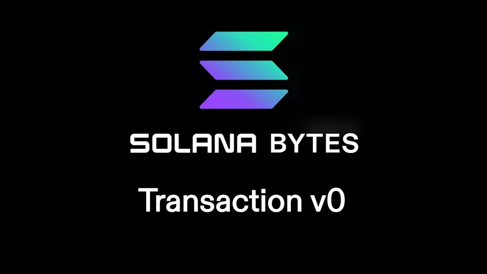

# [00:05](https://youtu.be/8k68cMeLX2U?t=5) Introduction to Version Transactions and Address Lookup Tables

Section Overview: In this section, the speaker introduces version transactions and address lookup tables on Solana. They explain that the new version of transactions will soon be available, requiring users to download the Edge release of the CLI. The speaker also mentions that there are resources available for more information on this topic.

## Version Transactions

- Users can use the `Edge` release of the CLI to access address lookup tables from the command line.
- The speaker mentions that there are resources available for more information on version transactions.

## Creating an Address Lookup Table

- To create an address lookup table, a specific method is used with a payload.
- The Authority payer and recent slot are passed in as parameters to get back the instruction and public key of the address lookup table.
- Multiple addresses can be added to the table at once by passing in a list of addresses as parameters.

## Sending Transactions with and without Address Lookup Tables

- The speaker explains that they will demonstrate sending a transaction without using an address lookup table, followed by sending one with it.
- When sending a transaction without using an address lookup table, it is compiled to v0 message without any additional parameters.
- To use an address lookup table, it needs to be passed in as a parameter when compiling the transaction.

## Printing Address Lookup Table

- A newer version of Solana web3js allows printing the address lookup table using connection object functions.
- The connection object is used to retrieve the lookup table and iterate over its addresses for printing purposes.

# [04:45](https://youtu.be/8k68cMeLX2U?t=285) Test Run and Explorer Analysis

Section Overview: In this section, the speaker runs a test and analyzes its results on Solana Explorer. They show how addresses are added to the lookup table during testing.

## Test Run Results

- The speaker shows the test run results, including the creation of a lookup table and the addition of addresses to it.
- The lookup table's address is displayed for reference.

# [05:00](https://youtu.be/8k68cMeLX2U?t=300) Conclusion

Section Overview: The speaker concludes the video by summarizing the process of creating an address lookup table and using it in transactions. They also mention that more information can be found in the provided resources.

## Summary

- The process of creating an address lookup table involves using specific methods and passing in parameters such as Authority payer and recent slot.
- Transactions can be sent with or without using an address lookup table, with additional steps required when using v0 transactions.
- The Solana Explorer provides evidence of the address lookup table's functionality.
- Resources are available for further information on version transactions and address lookup tables.

Note: This summary is based on a partial transcript.
# [t=338s] Introduction and Setting up Test Account

Section Overview: In this section, the speaker discusses setting up a test account using the CLI (Command Line Interface) and introduces the concept of address lookup tables for transfers.

## Setting up Test Account
- Use the CLI to set up a test account.
- Fund the test account to have some SOL (SOLANA token) for transactions.

# [t=357s] Transfer Signature without Address Lookup Table

Section Overview: The speaker explains the signature of a transfer without using an address lookup table.

## Transfer Signature
- The transfer involves one address being transferred to another.
- The signature includes information about the fee payer and signer.
- On-chain verification confirms that the addresses used in the transfer match those created and currently in use.

# [t=366s] Transfer Signature with Address Lookup Table

Section Overview: The speaker compares the transfer signature when using an address lookup table.

## Changes with Address Lookup Table
- The addresses used in the transfer remain the same.
- However, the transaction meta data recognizes that an address lookup table was used.
- Using an address lookup table can potentially improve performance and allow for larger transactions by adding more addresses to transfers.
- Exploring further documentation on these new features is recommended.

# [t=410s] Advantages of Address Lookup Tables

Section Overview: The speaker highlights advantages of using address lookup tables in transactions.

## Benefits of Address Lookup Tables
- By utilizing address lookup tables, it is possible to expand on transaction capabilities by adding more addresses to transfers.
- This can significantly increase the size of lists of accounts involved in transactions.
- Take advantage of this powerful technology to enhance transaction efficiency and scalability.

# [t=429s] Additional Resources on New Transaction Features

Section Overview: The speaker encourages exploring additional resources on new transaction features, including address lookup tables.

## Additional Resources
- Other videos and documentation are available to provide more information on these new transaction features.
- A recommended document provides guidance on setting up new transactions, including the use of address lookup tables.

# [t=467s] Conclusion and Key Takeaways

Section Overview: The speaker concludes by summarizing the key points discussed regarding new transaction features and address lookup tables.

## Key Takeaways
- New transaction versions (v0) allow for the use of address lookup tables.
- Address lookup tables can enhance transaction capabilities by adding more addresses to transfers.
- Utilizing address lookup tables improves efficiency and scalability in transactions.
- Explore additional resources for a deeper understanding of these new features.

[Generated with Video Highlight](https://videohighlight.com/video/summary/8k68cMeLX2U)