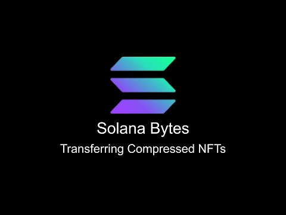

# [00:05](https://youtu.be/FOO5eT7K_e4?t=5) Introduction to Transferring Compressed NFTs and Fetching Asset Data

Section Overview: In this section, Nick from the Salana Foundation Devil Team introduces the topic of transferring compressed NFTs and fetching asset data from RPC indexers.

## Querying Blockchain for Asset Information

- To query the blockchain for asset information, a custom wrapper connect class is used as an extension on top of the normal web3.js connection class.
- An example is shown where all assets owned by a test wallet address are retrieved from the RPC.
- The returned information is logged to the console, with specific focus on compressed NFTs.
- Another request is made to retrieve assets owned by another user address, filtering out compressed NFTs from the same tree as the original request.

# [02:04](https://youtu.be/FOO5eT7K_e4?t=124) Transferring Compressed NFTs

Section Overview: This section focuses on transferring ownership of compressed NFTs.

## Setting Up Transfer Process

- A connection to the cluster is established and test and payer wallets are loaded.
- The asset IDs for two assets owned by different user accounts are obtained.
- The asset information and proof data are fetched from the RPC.

## Verification and Transfer Instruction

- Merkel tree account information is retrieved from the Salana blockchain using the concurrent Merkel tree account class in the compression program SDK.
- Verification of proof validity is performed (optional client-side verification).
- A transfer instruction is built to transfer ownership of a compressed NFT, including new leaf owner, current leaf owner and delegate, tree authority, tree depth values, and proof path manipulation.

Please note that these summaries provide an overview of each section. For more detailed information, refer to the corresponding timestamps in the transcript.
# [05:06](https://youtu.be/FOO5eT7K_e4?t=306) Refetching Asset and Logging Owner Information

Section Overview: In this section, the speaker discusses the process of refetching an asset and logging the new and old owner information for demonstration purposes.

## Refetching Asset and Logging Owner Information

- The script is executed to refetch the same asset and log out the new and old owner information.
- The current information, including proof values, is logged to the console.
- The transaction is then sent.

# [05:24](https://youtu.be/FOO5eT7K_e4?t=324) Conclusion

Section Overview: This section concludes the discussion on refetching assets and logging owner information.

## Conclusion

- No specific content or action takes place in this part of the transcript.

[Generated with Video Highlight](https://videohighlight.com/video/summary/FOO5eT7K_e4)