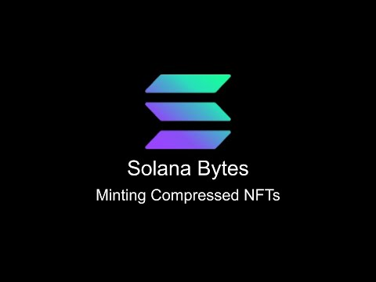

# [00:05](https://youtu.be/A_U1Nd41vPc?t=5) Introduction to Minting Compressed NFTs on Solana

Section Overview: In this section, Nick from the Solana Foundation Developper team introduces the topic of minting compressed NFTs on Solana and provides an overview of the code used in the tutorial.

## Setting Up the Environment

- The speaker is connected to Devnet using a pre-set up account called "Nick" that is funded with SOL.
- The current balance of the account is approximately 39.8 SOL.

## Code Setup and Imports

- The code uses TypeScript and imports various libraries including web3.js, Metaplex token metadata SDKs, account compression SDK, and bubblegum SDK for working with compressed NFTs.

## Wallets and Connection Setup

- Two wallets are defined: one for the payer (loaded from the file system) and another for generating a new test wallet.
- A connection to the Solana cluster is established using an RPC URL stored as an environment variable.
- A custom wrapper connection class is used to simplify making RPC calls.

## Defining Tree Size Parameters

- Three primary values are defined to determine the tree size and cost of creating it on-chain: max depth, buffer size, and canopy depth.
- Max depth represents the total number of nodes in the tree. Can be calculated using 2^max_depth.
- Canopy depth determines how much additional on-chain data will be stored in a secure change log.

## Calculating Space Requirements and Storage Cost

- The space required to allocate the Merkel Tree on-chain is calculated based on its size.
- The storage cost for renting exempt space is also calculated.

## Creating the Tree

- A helper function is used to create a tree authority address owned by Bubblegum program (the compressed NFT standard).
- Space allocation for the tree on-chain is done using the `alloc` function from the compression SDK.
- Tree instructions are created using the helper function provided by the Bubblegum SDK, specifying Merkel tree value and compression program.
- The instructions are sent as a transaction to the cluster and signed.

## Creating the NFT Collection

- The Metaplex standard is used to create both compressed and traditional NFT collections.
- The process of creating a compressed NFT collection is similar to that of a non-compressed collection.

# [04:47](https://youtu.be/A_U1Nd41vPc?t=287) Conclusion

Section Overview: This section concludes the tutorial on minting compressed NFTs on Solana.
# [05:21](https://youtu.be/A_U1Nd41vPc?t=321) NFT Collections and Trees on Chain

Section Overview: This section discusses the concept of NFT collections and how multiple trees can be used within a collection to store a large number of NFTs on chain.

## NFT Collections and Tree Usage

- NFT collections can have multiple trees within them, especially for storing large collections on chain.
- Using multiple smaller trees is recommended to avoid exceeding transaction size limits due to the amount of transaction bytes required.
- The process of creating compressed NFTs on chain follows the same metadata standard as traditional NFTs on Solana.

# [06:06](https://youtu.be/A_U1Nd41vPc?t=366) Minting Compressed NFTs

Section Overview: This section explains how to mint compressed NFTs using helper functions and provides details about the mint instruction parameters.

## Minting Compressed NFTs

- A helper function is used to mint compressed NFTs, with information about the tree, collection, and receiver address.
- The bubblegum program's signer is derived from the tree Authority, with a hard-coded value of collection CPI.
- The mint instruction includes standard information for an NFT mint, along with the Merkel tree address, tree Authority, delegate, leaf owner, and leaf delegate values.
- Additional accounts such as compression program, log wrapper program, and token metadata program are passed in for minting.
- The nft metadata is sent to the chain and securely stored by hashing it on-chain.

# [07:55](https://youtu.be/A_U1Nd41vPc?t=475) Cost Analysis and Script Execution

Section Overview: This section covers analyzing the cost of creating an entire compressed NFT collection and executing the script.

## Cost Analysis and Script Execution

- After running the script to create a compressed NFT collection and mint two compressed NFTs to different wallet addresses:
  - The total cost of creating the tree, NFT collection, and minting tokens is calculated to be 45.
  - The space required for the tree based on depth size and canopy size is shown.
  - Creating the tree incurs the bulk of the transaction cost, while subsequent actions only require paying the transaction fee.

# [08:33](https://youtu.be/A_U1Nd41vPc?t=513) Conclusion

Section Overview: This section concludes the transcript by summarizing the key points discussed in creating compressed NFT collections on Solana.

## Key Points

- NFT collections can utilize multiple trees to store a large number of NFTs on chain efficiently.
- Minting compressed NFTs follows similar metadata standards as traditional NFTs on Solana.
- The cost analysis reveals that creating the tree incurs a significant upfront fee, while subsequent actions have lower transaction costs.

[Generated with Video Highlight](https://videohighlight.com/video/summary/A_U1Nd41vPc)