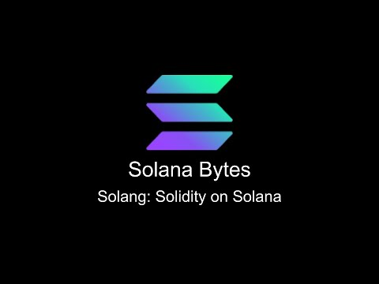

# [00:05](https://youtu.be/ALCHemQCDb4?t=5)

Section Overview: In this section, John from the Solana Foundation Developer Relations team introduces Soing, a tool for building on Solana using Solidity. He explains the initial steps to get started with Soing, including installing the Solana CLI and Anchor framework.

## Getting Started with Soing

- To start using Soing, you need to install the Solana CLI (version 1.16.1) and Anchor framework (version 0.28).
- Check your installed versions by running `solana -V` and `anchor --version`.
- Create a new project by running `anchor init <project-name> --language solidity`. This will generate a new project with boilerplate code.
- Use VS Code or the provided extension for convenient syntax highlighting.

## Understanding the Starter Code

- The starter code includes a basic smart contract with a constructor, flip function, and getter function.
- The program ID annotation specifies the on-chain address of the contract.
- The payer annotation determines who pays for storing the value in an account.

## Interacting with the Contract

- The test file demonstrates how to interact with the contract from a client perspective.
- Generate a new key pair as the address of the account to store variables.
- Create a new data account using the constructor instruction within the contract, specifying the wallet public key as payer.
- Use functions like `get` to retrieve values stored in accounts and `flip` to update values.

## Building and Testing

- Build your program by running `anchor build`.
- Test your program by running `anchor test`.
- Transaction signatures, initial state, updated state, and program logs can be inspected during testing.

# [02:47](https://youtu.be/ALCHemQCDb4?t=167)

Section Overview: In this section, John provides additional resources for learning more about Soling and invites questions from viewers.

## Learning More about Soling

- Visit the Solana Developers Program Examples, specifically the Basics and Tokens section, for reference implementations of common Solana use cases.

## Getting Help and Asking Questions

- Drop any questions on the Solana Stack Exchange for assistance.
- Join the Hyperledger Foundation Discord to engage with the community and ask questions related to containers.

Note: Timestamps are provided in seconds (s) format.

[Generated with Video Highlight](https://videohighlight.com/video/summary/ALCHemQCDb4)