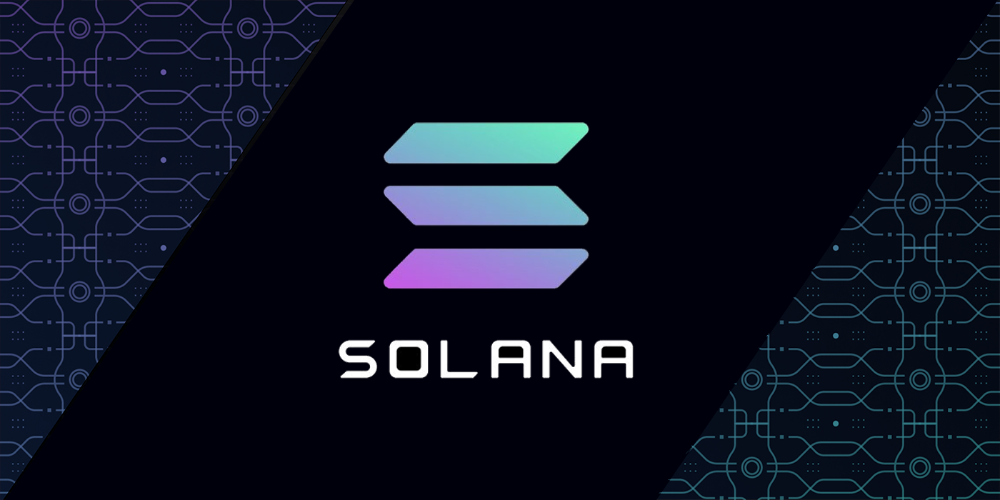

# Solana Bytes

**Link** : [Solana Bytes - The Solana Programming Model - YouTube](https://www.youtube.com/watch?v=pRYs49MqapI&list=PLilwLeBwGuK51Ji870apdb88dnBr1Xqhm&index=14)

- [01 - The Solana Programming Model](https://github.com/Laugharne/solana_bytes/tree/main/01%20-%20The%20Solana%20Programming%20Model)
- [02 - Hello World](https://github.com/Laugharne/solana_bytes/tree/main/02%20-%20Hello%20World)
- [03 - Intro to Anchor](https://github.com/Laugharne/solana_bytes/tree/main/03%20-%20Intro%20to%20Anchor)
- [04 - Intro to Seachor](https://github.com/Laugharne/solana_bytes/tree/main/04%20-%20Intro%20to%20Seachor)
- [05 - Accounts](https://github.com/Laugharne/solana_bytes/tree/main/05%20-%20Accounts)
- [06 - Cross Program Invocation](https://github.com/Laugharne/solana_bytes/tree/main/06%20-%20Cross%20Program%20Invocation)
- [07 - Custom Account Data](https://github.com/Laugharne/solana_bytes/tree/main/07%20-%20Custom%20Account%20Data)
- [08 - Program Derived Addresses](https://github.com/Laugharne/solana_bytes/tree/main/08%20-%20Program%20Derived%20Addresses)
- [09 - Processing Instructions (Native)](https://github.com/Laugharne/solana_bytes/tree/main/09%20-%20Processing%20Instructions%20(Native))
- [10 - Transfert SOL (CPI, Program & Client)](https://github.com/Laugharne/solana_bytes/tree/main/10%20-%20Transfert%20SOL%20(CPI%2C%20Program%20%26%20Client))
- [11 - Transaction v0 & Lookup tables](https://github.com/Laugharne/solana_bytes/tree/main/11%20-%20Transaction%20v0%20%26%20Lookup%20tables)
- [12 - Transfering Compressed NFTs](https://github.com/Laugharne/solana_bytes/tree/main/12%20-%20Transfering%20Compressed%20NFTs)
- [13 - Minting Compressed NFTs](https://github.com/Laugharne/solana_bytes/tree/main/13%20-%20Minting%20Compressed%20NFTs)
- [14 - Solidity on Solana with Solang](https://github.com/Laugharne/solana_bytes/tree/main/14%20-%20Solidity%20on%20Solana%20with%20Solang)
